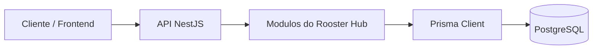

# Visão Geral do Rooster One

## Objetivo do projeto

O Rooster One é uma plataforma de gestão administrativa e operacional voltada para organização de usuários, permissões, setores, sessões e processos de auditoria. O backend foi estruturado para servir como camada de integração e regra de negócio para um ecossistema modular.

## Contexto do backend

O backend atual concentra o núcleo do sistema em um módulo principal chamado Rooster Hub, com serviços especializados para:

- cadastro e manutenção de usuários;
- organização por setores;
- definição de perfis e permissões;
- associação de usuários a perfis e setores;
- controle de sessões e notificações;
- registro de ações em logs de auditoria.

## Módulos existentes

| Módulo | Responsabilidade principal |
| --- | --- |
| Usuarios | Cadastro e manutenção de usuários |
| Setores | Organização estrutural por unidade/setor |
| Perfis | Agrupamento de permissões por função |
| Modulos | Identificação dos módulos e recursos do sistema |
| Permissoes | Definição de ações e recursos autorizáveis |
| UsuariosPerfis | Associação de usuários a perfis |
| UsuariosSetores | Associação de usuários a setores |
| PerfisPermissoes | Vínculo entre perfis e permissões |
| Notificacoes | Registro e gestão de mensagens internas |
| Sessoes | Controle de sessões ativas e refresh tokens |
| LogsAuditoria | Registro de ações e mudanças importantes |

## Arquitetura geral

A aplicação utiliza NestJS como framework principal, com estrutura modular e camada de acesso a dados baseada em Prisma.

## Tecnologias utilizadas

| Camada | Tecnologia |
| --- | --- |
| Framework | NestJS |
| Linguagem | TypeScript |
| ORM | Prisma |
| Banco | PostgreSQL |
| Validação | class-validator / class-transformer |
| Estrutura | módulos e services |

## Organização do backend

A aplicação segue um padrão de organização baseado em:

- módulos por domínio;
- controllers para entrada de requisições;
- services para regras de negócio;
- DTOs para validação e transferência de dados;
- Prisma para persistência;
- módulos importados pelo módulo principal do Rooster Hub.

## Padrão de desenvolvimento adotado

O padrão adotado é:

1. manter o controller enxuto;
2. centralizar a regra de negócio no service;
3. usar DTOs para entrada de dados;
4. manter os módulos desacoplados e reutilizáveis;
5. usar Prisma como camada única de acesso ao banco;
6. documentar novas regras e decisões arquiteturais.

## Como os módulos se comunicam

Os módulos se comunicam principalmente por meio de:

- serviços próprios;
- relações explicitadas no Prisma;
- módulos importados no módulo principal;
- uso de identificadores UUID para manter consistência entre entidades.

## Mecanismos do sistema

O backend já possui ou prevê mecanismos para:

- validação de entradas via DTOs;
- controle de permissões e perfis;
- gestão de sessões e notificações;
- auditoria de eventos;
- uso de UUIDs e convenções de banco;
- expansão para autenticação JWT, RBAC e uploads.

## Evolução esperada

O projeto já possui a base estrutural necessária para evoluir para cenários mais completos, como:

- autenticação real com JWT;
- autorização baseada em roles e permissões finas;
- paginação e filtros robustos;
- cache e logs distribuídos;
- upload de arquivos e integração com storage.
