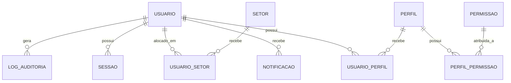

# Modelagem e Convenções do Banco de Dados

## Visão geral

O banco é modelado com Prisma e utiliza PostgreSQL. A estrutura atual prioriza rastreabilidade, organização administrativa e controle de acessos.

## Diagrama conceitual



## Entidades principais

| Entidade | Descrição |
| --- | --- |
| Usuario | Representa um usuário da plataforma |
| Setor | Unidade organizacional ou área funcional |
| Perfil | Agrupamento de permissões por função |
| Modulo | Recurso ou módulo do sistema |
| Permissao | Ação ou recurso autorizável |
| UsuarioPerfil | Associação usuário-perfil |
| UsuarioSetor | Associação usuário-setor |
| PerfilPermissao | Associação perfil-permissão |
| Notificacao | Mensagem interna para o usuário |
| Sessao | Registro de sessão ativa e refresh token |
| LogAuditoria | Registro de eventos críticos |

## Convenções de nomenclatura

- tabelas e campos em português, com mapeamento explícito para o banco;
- uso de `@map()` no Prisma para manter nomes em snake_case no banco;
- uso de UUID como identificador primário;
- campos de auditoria com sufixos como `criado_em`, `atualizado_em`.

## Relacionamentos principais

| Relação | Observação |
| --- | --- |
| Usuario x Perfil | Muitos para muitos via `usuarios_perfis` |
| Usuario x Setor | Muitos para muitos via `usuarios_setores` |
| Perfil x Permissao | Muitos para muitos via `perfis_permissoes` |
| Usuario x Notificacao | Um usuário pode ter várias notificações |
| Usuario x Sessao | Um usuário pode ter várias sessões |
| Usuario x LogAuditoria | Um usuário pode gerar vários registros |

## Boas práticas adotadas

- uso de `@default(uuid())` para chaves primárias;
- uso de `Boolean` para flags de ativo/inativo;
- uso de campos opcionais para dados que podem não existir;
- separação de tabelas de associação para evitar relações diretas complexas.

## Migrations e evolução do schema

As migrations devem ser geradas e aplicadas de forma controlada:

```bash
npm run prisma:migrate
npm run prisma:deploy
```

## Índices e performance

Como evolução, recomenda-se:

- criar índices em colunas frequentemente filtradas;
- avaliar consultas por `email`, `ativo`, `modulo` e `usuario_id`;
- proteger campos sensíveis como `senha_hash` e `refresh_token`.

## Observações

A modelagem atual é robusta para o núcleo administrativo, mas ainda pode evoluir para cenários mais complexos, como:

- histórico de alterações;
- versionamento de permissões;
- logs estruturados com contexto adicional.
