# Relacionamentos — Rooster One

As relações abaixo foram extraídas diretamente das declarações `@relation` de `prisma/schema.prisma`. Não há tabela de junção implícita além das modeladas explicitamente (`UsuarioPermissao`, `UsuarioSetor`, `AtendimentoSubcategoria`, `CursoOrientadorBoost` e `DescontoAluno`); as demais relações são 1:N simples (chave estrangeira opcional ou obrigatória que referencia uma chave primária).

Observação: diversos campos com aparência de chave estrangeira (`Reserva.responsavelId`, `Reserva.setorId`, `Reserva.decididoPor`, `Patrimonio.localizacaoId`, `Patrimonio.responsavelUserId`, `Patrimonio.chamadoManutencaoId` e, no Academy e no Learn, `DocumentoAcademico.autorId`, `RegistroFrequencia.registradoPorId`, `Nota.lancadoPorId` e `Entrega.corrigidoPorId`) **não possuem `@relation` no Prisma**: são colunas `Uuid?` sem restrição de chave estrangeira navegável pelo cliente (ver `05-indices-e-constraints.md`). Este documento abrange apenas as relações modeladas com `@relation`.

## Módulo Hub

| Relação | Cardinalidade | Campo FK | onDelete |
|---|---|---|---|
| Usuario → RedefinicaoSenha | 1:N | `RedefinicaoSenha.usuarioId` | Cascade |
| Usuario ↔ Permissao (via UsuarioPermissao) | N:N | `UsuarioPermissao.usuarioId` / `.permissaoId` | Cascade / Cascade |
| Usuario ↔ Setor (via UsuarioSetor) | N:N | `UsuarioSetor.usuarioId` / `.setorId` | (padrão) |
| Modulo → Permissao | 1:N | `Permissao.moduloId` | (padrão, opcional) |
| Usuario → Notificacao | 1:N | `Notificacao.usuarioId` | (padrão, opcional) |
| Usuario → Sessao | 1:N | `Sessao.usuarioId` | (padrão, opcional) |
| Usuario → LogAuditoria | 1:N | `LogAuditoria.usuarioId` | (padrão, opcional) |
| Usuario → LogErro | 1:N | `LogErro.usuarioId` | SetNull (opcional) |

Não há modelo `Perfil` ou `Role` no schema atual: o vínculo de autorização é direto entre `Usuario` e `Permissao`, por meio de `UsuarioPermissao`. Essa arquitetura substituiu um modelo anterior (`Perfil`, `usuarios_perfis` e `perfis_permissoes`), removido pela migration `20260916125542_usuarios_permissoes` (ver `04-migrations.md`).

## Módulo Desk

| Relação | Cardinalidade | Campo FK | onDelete |
|---|---|---|---|
| Setor → CategoriaTicket | 1:N | `CategoriaTicket.setorId` | (padrão, opcional) |
| CategoriaTicket → SubcategoriaTicket | 1:N | `SubcategoriaTicket.categoriaId` | (padrão, opcional) |
| CategoriaTicket → Ticket | 1:N | `Ticket.categoriaId` | (padrão, opcional) |
| SubcategoriaTicket → Ticket | 1:N | `Ticket.subcategoriaId` | (padrão, opcional) |
| SubcategoriaTicket ↔ Usuario (via AtendimentoSubcategoria) | N:N | `AtendimentoSubcategoria.subcategoriaId` / `.usuarioId` | Cascade / Cascade |
| PrioridadeTicket → Ticket | 1:N | `Ticket.prioridadeId` | (padrão, opcional) |
| StatusTicket → Ticket | 1:N | `Ticket.statusId` | (padrão, opcional) |
| Usuario → Ticket (solicitante) | 1:N | `Ticket.usuarioId`, relação nomeada `TicketSolicitante` | (padrão, opcional) |
| Usuario → Ticket (técnico) | 1:N | `Ticket.tecnicoId`, relação nomeada `TicketTecnico` | (padrão, opcional) |
| Ticket → MensagemTicket | 1:N | `MensagemTicket.ticketId` | Cascade |
| Usuario → MensagemTicket | 1:N | `MensagemTicket.usuarioId` | (padrão, obrigatório → Restrict implícito) |
| Ticket → AnexoTicket | 1:N | `AnexoTicket.ticketId` | (padrão, opcional) |
| Usuario → AnexoTicket | 1:N | `AnexoTicket.usuarioId` | (padrão, opcional) |
| Ticket → HistoricoTicket | 1:N | `HistoricoTicket.ticketId` | (padrão, opcional) |
| Usuario → HistoricoTicket | 1:N | `HistoricoTicket.usuarioId` | (padrão, opcional) |
| Ticket → AvaliacaoTicket | 1:N | `AvaliacaoTicket.ticketId` | (padrão, opcional) |
| Usuario → AvaliacaoTicket | 1:N | `AvaliacaoTicket.usuarioId` | (padrão, opcional) |

`Ticket` possui **duas** relações distintas com `Usuario` (solicitante e técnico); por isso, o Prisma exige nomes de relação explícitos (`@relation("TicketSolicitante")` e `@relation("TicketTecnico")`) para distinguir as duas chaves estrangeiras que referenciam a mesma tabela.

## Módulo Rooms

| Relação | Cardinalidade | Campo FK | onDelete |
|---|---|---|---|
| Campus → Bloco | 1:N | `Bloco.campusId` | Cascade |
| Campus → Ambiente | 1:N | `Ambiente.campusId` | Cascade |
| Bloco → Ambiente | 1:N | `Ambiente.blocoId` | Cascade |
| Ambiente → Reserva | 1:N | `Reserva.ambienteId` | Restrict |
| Turma (Academy) → Reserva | 1:N (opcional) | `Reserva.turmaId` | SetNull |
| Reserva → ReservaMensagem | 1:N | `ReservaMensagem.reservaId` | Cascade |
| Usuario → ReservaMensagem | 1:N | `ReservaMensagem.usuarioId` | (padrão, obrigatório → Restrict implícito) |
| Reserva → ReservaHistorico | 1:N | `ReservaHistorico.reservaId` | Cascade |
| Usuario → ReservaHistorico | 1:N | `ReservaHistorico.usuarioId` | (padrão, opcional) |

`Reserva` possui os campos `responsavelId`, `setorId` e `decididoPor`, que armazenam identificadores de usuário e de setor **sem** `@relation` no Prisma: são referências desnormalizadas, com o nome correspondente gravado em texto no campo adjacente (`responsavel` e `setor`). O mesmo padrão ocorre em `Patrimonio` (`localizacaoId`, `responsavelUserId` e `chamadoManutencaoId`). Essas colunas não constam do diagrama ER, por não constituírem relações navegáveis no Prisma.

## Módulo Assets

| Relação | Cardinalidade | Campo FK | onDelete |
|---|---|---|---|
| PatrimonioCategoria → Patrimonio | 1:N | `Patrimonio.categoriaId` | (padrão, obrigatório → Restrict implícito) |
| PatrimonioSetor → Patrimonio | 1:N | `Patrimonio.setorId` (relação `setorRef`) | (padrão, opcional) |
| Patrimonio → PatrimonioMovimento | 1:N | `PatrimonioMovimento.patrimonioId` | Cascade |

## Módulo Academy

| Relação | Cardinalidade | Campo FK | onDelete |
|---|---|---|---|
| Usuario → Professor | 1:1 | `Professor.usuarioId` (`@unique`), relação `professorAcademico` | Restrict |
| Usuario → Aluno | 1:1 | `Aluno.usuarioId` (`@unique`), relação `alunoAcademico` | Restrict |
| Curso → Disciplina | 1:N | `Disciplina.cursoId` | Restrict |
| Curso → Aluno | 1:N | `Aluno.cursoId` | Restrict |
| PeriodoLetivo → Turma | 1:N | `Turma.periodoLetivoId` | Restrict |
| Disciplina → Turma | 1:N | `Turma.disciplinaId` | Restrict |
| Disciplina → DocumentoAcademico | 1:N | `DocumentoAcademico.disciplinaId` | SetNull (opcional) |
| Professor → Turma | 1:N | `Turma.professorId` | SetNull (opcional) |
| Aluno → Matricula | 1:N | `Matricula.alunoId` | Cascade |
| Turma → Matricula | 1:N | `Matricula.turmaId` | Cascade |
| Turma → RegistroFrequencia | 1:N | `RegistroFrequencia.turmaId` | Cascade |
| Aluno → RegistroFrequencia | 1:N | `RegistroFrequencia.alunoId` | Cascade |
| Turma → ItemAvaliativo | 1:N | `ItemAvaliativo.turmaId` | Cascade |
| ItemAvaliativo → Nota | 1:N | `Nota.itemAvaliativoId` | Cascade |
| Aluno → Nota | 1:N | `Nota.alunoId` | Cascade |

`EventoCalendarioAcademico` não possui chave estrangeira modelada (sem `@relation`) e constitui tabela isolada em relação às demais entidades do Academy. `DocumentoAcademico.autorId`, `RegistroFrequencia.registradoPorId` e `Nota.lancadoPorId` armazenam identificador de `Usuario` **sem** `@relation` no Prisma (mesmo padrão de `Reserva.responsavelId` e `Patrimonio.localizacaoId`; ver a nota do módulo Rooms) e não constam do diagrama.

**Professor e Aluno não duplicam a tabela `usuarios`**: `Professor.usuarioId` e `Aluno.usuarioId` são chaves estrangeiras obrigatórias e únicas para `Usuario.id`; a criação de professor ou de aluno sempre vincula um `Usuario` existente no Hub, sem criar nova conta. `AcademyService.createProfessor` e `createAluno` verificam que o `usuarioId` existe e ainda não possui vínculo (`ConflictException` em caso contrário).

## Módulo Learn

Todas as entidades do Learn referenciam entidades do Academy; o Learn não possui turmas, professores ou alunos próprios.

| Relação | Cardinalidade | Campo FK | onDelete |
|---|---|---|---|
| Turma (Academy) → Atividade | 1:N | `Atividade.turmaId` | Restrict |
| Professor (Academy) → Atividade | 1:N | `Atividade.professorId` | SetNull (opcional) |
| Atividade → Entrega | 1:N | `Entrega.atividadeId` | Cascade |
| Aluno (Academy) → Entrega | 1:N | `Entrega.alunoId` | Cascade |
| Entrega → AnexoEntrega | 1:N | `AnexoEntrega.entregaId` | Cascade |
| Atividade → QuestaoAtividade | 1:N | `QuestaoAtividade.atividadeId` | Cascade |
| QuestaoAtividade → AlternativaQuestao | 1:N | `AlternativaQuestao.questaoId` | Cascade |
| Entrega → RespostaQuestao | 1:N | `RespostaQuestao.entregaId` | Cascade |
| QuestaoAtividade → RespostaQuestao | 1:N | `RespostaQuestao.questaoId` | Cascade |
| QuestaoAtividade → AnexoEntrega | 1:N (opcional) | `AnexoEntrega.questaoId` | SetNull |
| Atividade ↔ ItemAvaliativo (Academy) | 1:1 (opcional) | `ItemAvaliativo.atividadeId` (`@unique`) | SetNull |

A última linha corresponde à integração Learn → Academy: ao publicar atividade com peso, o Learn cria um `ItemAvaliativo` no Academy que referencia a `Atividade` (`atividadeId`, único: no máximo um item avaliativo por atividade). `Entrega.corrigidoPorId` armazena identificador de `Usuario` sem `@relation` no Prisma (mesmo padrão citado acima).

---

## Módulo Boost

`BoostUsuario` constitui raiz de relacionamento própria; o único vínculo com `Usuario` (Hub) é opcional e 1:1, preenchido apenas na conta do usuário institucional (RN045). O `CursoBoost` não possui responsável exclusivo; o `Professor` (Academy) participa como orientador, por meio de `CursoOrientadorBoost`, e como autor de mensagens nas conversas.

| Relação | Cardinalidade | Campo FK | onDelete |
|---|---|---|---|
| CursoBoost → CursoOrientadorBoost | 1:N | `CursoOrientadorBoost.cursoId` | Cascade |
| Professor (Academy) → CursoOrientadorBoost | 1:N | `CursoOrientadorBoost.professorId` | Restrict |
| CursoBoost → ModuloBoost | 1:N | `ModuloBoost.cursoId` | Cascade |
| ModuloBoost → AulaBoost | 1:N | `AulaBoost.moduloId` | Cascade |
| AulaBoost → MaterialApoio | 1:N | `MaterialApoio.aulaId` | Cascade |
| Usuario → BoostUsuario | 1:1 (opcional) | `BoostUsuario.usuarioId` (`@unique`) | SetNull |
| BoostUsuario → MatriculaBoost | 1:N | `MatriculaBoost.boostUsuarioId` | Cascade |
| CursoBoost → MatriculaBoost | 1:N | `MatriculaBoost.cursoId` | Cascade |
| MatriculaBoost → ProgressoAula | 1:N | `ProgressoAula.matriculaId` | Cascade |
| AulaBoost → ProgressoAula | 1:N | `ProgressoAula.aulaId` | Cascade |
| MatriculaBoost ↔ CertificadoBoost | 1:1 (opcional) | `CertificadoBoost.matriculaId` (`@unique`) | Cascade |
| CursoBoost → ConversaBoost | 1:N | `ConversaBoost.cursoId` | Cascade |
| BoostUsuario → ConversaBoost | 1:N | `ConversaBoost.boostUsuarioId` | Cascade |
| BoostUsuario → RedefinicaoSenhaBoost | 1:N | `RedefinicaoSenhaBoost.boostUsuarioId` | Cascade |
| ConversaBoost → MensagemBoost | 1:N | `MensagemBoost.conversaId` | Cascade |
| BoostUsuario → MensagemBoost | 1:N (opcional) | `MensagemBoost.boostUsuarioId` | — (sem `onDelete` explícito) |
| Professor (Academy) → MensagemBoost | 1:N (opcional) | `MensagemBoost.professorId` | — (sem `onDelete` explícito) |

`MatriculaBoost` possui `@@unique([boostUsuarioId, cursoId])` (nova matrícula no mesmo curso é idempotente), `ProgressoAula` possui `@@unique([matriculaId, aulaId])` (nova conclusão da mesma aula executa `upsert`, sem duplicidade) e `ConversaBoost` possui `@@unique([cursoId, boostUsuarioId])` (uma conversa por aluno em cada curso). `MensagemBoost` possui dois campos de autor opcionais, dos quais exatamente um é preenchido em cada mensagem, condição garantida pela aplicação (`BoostService` e `BoostPortalService`), e não por restrição do banco.

## Módulo Finance

Toda cobrança referencia um `Aluno` do Academy; o Finance não possui identidade de aluno própria.

| Relação | Cardinalidade | Campo FK | onDelete |
|---|---|---|---|
| Aluno (Academy) → Cobranca | 1:N | `Cobranca.alunoId` | (padrão, obrigatório → Restrict implícito) |
| Produto → Cobranca | 1:N (opcional) | `Cobranca.produtoId` | (padrão, opcional) |
| Servico → Cobranca | 1:N (opcional) | `Cobranca.servicoId` | (padrão, opcional) |
| Desconto → Cobranca | 1:N (opcional) | `Cobranca.descontoId` | (padrão, opcional) |
| PoliticaMultaJuros → Cobranca | 1:N (opcional) | `Cobranca.politicaMultaJurosId` | (padrão, opcional) |
| PoliticaMultaJuros → Servico | 1:N (opcional) | `Servico.politicaMultaJurosId` | (padrão, opcional) |
| Usuario → PoliticaMultaJuros | 1:N (opcional) | `PoliticaMultaJuros.criadoPorId` | (padrão, opcional) |
| Aluno ↔ Desconto (via DescontoAluno) | N:N | `DescontoAluno.alunoId` / `.descontoId` | Cascade / Cascade |
| Cobranca ↔ NotaFiscal | 1:1 (opcional) | `NotaFiscal.cobrancaId` (`@unique`) | Cascade |

`Cobranca` possui três chaves estrangeiras opcionais de origem (`produtoId`, `servicoId` e `descontoId`), pois a cobrança pode referir-se a mensalidade (serviço), a produto ou a taxa avulsa. Cada `NotaFiscal` documenta exatamente uma cobrança.

---

## Diagrama ER (Mermaid)

O diagrama abrange as entidades centrais dos oito módulos com tabelas próprias e todas as relações Prisma (`@relation`) entre elas, incluindo as tabelas de junção N:N modeladas explicitamente (`UsuarioPermissao`, `UsuarioSetor`, `AtendimentoSubcategoria`, `CursoOrientadorBoost` e `DescontoAluno`).

```mermaid
erDiagram
    %% ===== Hub =====
    USUARIO ||--o{ REDEFINICAO_SENHA : "possui"
    USUARIO ||--o{ USUARIO_PERMISSAO : "recebe"
    PERMISSAO ||--o{ USUARIO_PERMISSAO : "concedida em"
    USUARIO ||--o{ USUARIO_SETOR : "vinculado a"
    SETOR ||--o{ USUARIO_SETOR : "possui"
    MODULO ||--o{ PERMISSAO : "agrupa"
    USUARIO ||--o{ NOTIFICACAO : "recebe"
    USUARIO ||--o{ SESSAO : "abre"
    USUARIO ||--o{ LOG_AUDITORIA : "gera"
    USUARIO ||--o{ LOG_ERRO : "associado a"

    %% ===== Desk =====
    SETOR ||--o{ CATEGORIA_TICKET : "responde por"
    CATEGORIA_TICKET ||--o{ SUBCATEGORIA_TICKET : "possui"
    CATEGORIA_TICKET ||--o{ TICKET : "classifica"
    SUBCATEGORIA_TICKET ||--o{ TICKET : "classifica"
    SUBCATEGORIA_TICKET ||--o{ ATENDIMENTO_SUBCATEGORIA : "atendida por"
    USUARIO ||--o{ ATENDIMENTO_SUBCATEGORIA : "atende"
    PRIORIDADE_TICKET ||--o{ TICKET : "define prioridade"
    STATUS_TICKET ||--o{ TICKET : "define status"
    USUARIO ||--o{ TICKET : "abre (solicitante)"
    USUARIO ||--o{ TICKET : "atende (tecnico)"
    TICKET ||--o{ MENSAGEM_TICKET : "possui"
    USUARIO ||--o{ MENSAGEM_TICKET : "escreve"
    TICKET ||--o{ ANEXO_TICKET : "possui"
    USUARIO ||--o{ ANEXO_TICKET : "envia"
    TICKET ||--o{ HISTORICO_TICKET : "possui"
    USUARIO ||--o{ HISTORICO_TICKET : "gera"
    TICKET ||--o{ AVALIACAO_TICKET : "recebe"
    USUARIO ||--o{ AVALIACAO_TICKET : "avalia"

    %% ===== Rooms =====
    CAMPUS ||--o{ BLOCO : "possui"
    CAMPUS ||--o{ AMBIENTE : "possui"
    BLOCO ||--o{ AMBIENTE : "possui"
    AMBIENTE ||--o{ RESERVA : "reservado em"
    TURMA ||--o{ RESERVA : "vinculada a (opcional)"
    RESERVA ||--o{ RESERVA_MENSAGEM : "possui"
    USUARIO ||--o{ RESERVA_MENSAGEM : "escreve"
    RESERVA ||--o{ RESERVA_HISTORICO : "possui"
    USUARIO ||--o{ RESERVA_HISTORICO : "gera"

    %% ===== Assets =====
    PATRIMONIO_CATEGORIA ||--o{ PATRIMONIO : "classifica"
    PATRIMONIO_SETOR ||--o{ PATRIMONIO : "guarda"
    PATRIMONIO ||--o{ PATRIMONIO_MOVIMENTO : "possui"

    %% ===== Academy =====
    USUARIO ||--o| PROFESSOR : "e (opcional)"
    USUARIO ||--o| ALUNO : "e (opcional)"
    CURSO ||--o{ DISCIPLINA : "cataloga"
    CURSO ||--o{ ALUNO : "matricula em"
    PERIODO_LETIVO ||--o{ TURMA : "oferece em"
    DISCIPLINA ||--o{ TURMA : "ofertada como"
    DISCIPLINA ||--o{ DOCUMENTO_ACADEMICO : "possui"
    PROFESSOR ||--o{ TURMA : "leciona"
    ALUNO ||--o{ MATRICULA : "matricula-se em"
    TURMA ||--o{ MATRICULA : "recebe"
    TURMA ||--o{ REGISTRO_FREQUENCIA : "registra"
    ALUNO ||--o{ REGISTRO_FREQUENCIA : "possui"
    TURMA ||--o{ ITEM_AVALIATIVO : "possui"
    ITEM_AVALIATIVO ||--o{ NOTA : "possui"
    ALUNO ||--o{ NOTA : "recebe"

    %% ===== Learn =====
    TURMA ||--o{ ATIVIDADE : "possui"
    PROFESSOR ||--o{ ATIVIDADE : "cria"
    ATIVIDADE ||--o{ ENTREGA : "recebe"
    ALUNO ||--o{ ENTREGA : "envia"
    ENTREGA ||--o{ ANEXO_ENTREGA : "possui"
    ATIVIDADE ||--o{ QUESTAO_ATIVIDADE : "contem"
    QUESTAO_ATIVIDADE ||--o{ ALTERNATIVA_QUESTAO : "oferece"
    ENTREGA ||--o{ RESPOSTA_QUESTAO : "responde"
    QUESTAO_ATIVIDADE ||--o{ RESPOSTA_QUESTAO : "respondida em"
    QUESTAO_ATIVIDADE |o--o{ ANEXO_ENTREGA : "arquivo da questao"
    ATIVIDADE ||--o| ITEM_AVALIATIVO : "gera (origem learn)"

    %% ===== Boost =====
    CURSO_BOOST ||--o{ CURSO_ORIENTADOR_BOOST : "possui"
    PROFESSOR ||--o{ CURSO_ORIENTADOR_BOOST : "orienta"
    CURSO_BOOST ||--o{ MODULO_BOOST : "possui"
    MODULO_BOOST ||--o{ AULA_BOOST : "possui"
    AULA_BOOST ||--o{ MATERIAL_APOIO : "possui"
    BOOST_USUARIO ||--o{ MATRICULA_BOOST : "matricula-se em"
    CURSO_BOOST ||--o{ MATRICULA_BOOST : "recebe"
    MATRICULA_BOOST ||--o{ PROGRESSO_AULA : "registra"
    AULA_BOOST ||--o{ PROGRESSO_AULA : "possui"
    MATRICULA_BOOST ||--o| CERTIFICADO_BOOST : "gera ao concluir"
    CURSO_BOOST ||--o{ CONVERSA_BOOST : "possui"
    BOOST_USUARIO ||--o{ CONVERSA_BOOST : "participa de"
    CONVERSA_BOOST ||--o{ MENSAGEM_BOOST : "contém"
    BOOST_USUARIO ||--o{ MENSAGEM_BOOST : "escreve (aluno)"
    PROFESSOR ||--o{ MENSAGEM_BOOST : "escreve (orientador)"

    %% ===== Finance =====
    ALUNO ||--o{ COBRANCA : "é cobrado em"
    PRODUTO ||--o{ COBRANCA : "origina"
    SERVICO ||--o{ COBRANCA : "origina"
    DESCONTO ||--o{ COBRANCA : "aplicado em"
    POLITICA_MULTA_JUROS ||--o{ COBRANCA : "rege"
    POLITICA_MULTA_JUROS ||--o{ SERVICO : "padrão de"
    USUARIO ||--o{ POLITICA_MULTA_JUROS : "cria"
    ALUNO ||--o{ DESCONTO_ALUNO : "recebe"
    DESCONTO ||--o{ DESCONTO_ALUNO : "atribuído em"
    COBRANCA ||--o| NOTA_FISCAL : "documentada por"

    USUARIO {
        uuid id PK
        string nome
        string email UK
        string senha_hash
        boolean ativo
    }
    REDEFINICAO_SENHA {
        uuid id PK
        uuid usuario_id FK
        string token_hash UK
        timestamp expira_em
    }
    SETOR {
        uuid id PK
        string nome
        boolean ativo
    }
    MODULO {
        uuid id PK
        string nome UK
        string rota
    }
    PERMISSAO {
        uuid id PK
        uuid modulo_id FK
        string nome
        string recurso
        string acao
    }
    USUARIO_PERMISSAO {
        uuid id PK
        uuid usuario_id FK
        uuid permissao_id FK
    }
    USUARIO_SETOR {
        uuid id PK
        uuid usuario_id FK
        uuid setor_id FK
    }
    NOTIFICACAO {
        uuid id PK
        uuid usuario_id FK
        boolean lida
    }
    SESSAO {
        uuid id PK
        uuid usuario_id FK
        boolean revogada
    }
    LOG_AUDITORIA {
        uuid id PK
        uuid usuario_id FK
        string acao
    }
    CATEGORIA_TICKET {
        uuid id PK
        uuid setor_id FK
        string nome
        int sla_horas
    }
    SUBCATEGORIA_TICKET {
        uuid id PK
        uuid categoria_id FK
        string nome
        int sla_horas
    }
    ATENDIMENTO_SUBCATEGORIA {
        uuid id PK
        uuid subcategoria_id FK
        uuid usuario_id FK
    }
    PRIORIDADE_TICKET {
        string id PK
        string nome
        string cor
    }
    STATUS_TICKET {
        uuid id PK
        string nome
        boolean encerrado
    }
    TICKET {
        uuid id PK
        string protocolo UK
        string titulo
        uuid usuario_id FK
        uuid tecnico_id FK
        uuid categoria_id FK
        uuid subcategoria_id FK
        string prioridade_id FK
        uuid status_id FK
        string_array tags
        boolean favorito
    }
    MENSAGEM_TICKET {
        uuid id PK
        uuid ticket_id FK
        uuid usuario_id FK
        string mensagem
        boolean interno
    }
    ANEXO_TICKET {
        uuid id PK
        uuid ticket_id FK
        uuid usuario_id FK
        string nome_arquivo
        bigint tamanho
    }
    HISTORICO_TICKET {
        uuid id PK
        uuid ticket_id FK
        uuid usuario_id FK
        string campo
    }
    AVALIACAO_TICKET {
        uuid id PK
        uuid ticket_id FK
        uuid usuario_id FK
        int nota
    }
    CAMPUS {
        uuid id PK
        string nome
        string codigo UK
    }
    BLOCO {
        uuid id PK
        uuid campus_id FK
        string codigo
    }
    AMBIENTE {
        uuid id PK
        uuid campus_id FK
        uuid bloco_id FK
        string codigo UK
        int capacidade
    }
    RESERVA {
        uuid id PK
        uuid ambiente_id FK
        string codigo UK
        uuid serie_id
        int serie_total
        string status
    }
    RESERVA_MENSAGEM {
        uuid id PK
        uuid reserva_id FK
        uuid usuario_id FK
        string mensagem
    }
    RESERVA_HISTORICO {
        uuid id PK
        uuid reserva_id FK
        uuid usuario_id FK
        string campo
    }
    PATRIMONIO_CATEGORIA {
        uuid id PK
        string nome UK
    }
    PATRIMONIO_SETOR {
        uuid id PK
        string nome UK
    }
    PATRIMONIO {
        uuid id PK
        uuid categoria_id FK
        uuid setor_id FK
        string tag UK
        string status
        decimal valor
    }
    PATRIMONIO_MOVIMENTO {
        uuid id PK
        uuid patrimonio_id FK
        string tipo
        date data_devolucao_prevista
        timestamp devolvido_em
    }
    CURSO {
        uuid id PK
        string nome
        string codigo UK
        string grau
    }
    PERIODO_LETIVO {
        uuid id PK
        string nome UK
        date data_inicio
        date data_fim
    }
    DISCIPLINA {
        uuid id PK
        uuid curso_id FK
        string codigo UK
        string nome
    }
    PROFESSOR {
        uuid id PK
        uuid usuario_id FK "UK"
        string titulacao
        string status
    }
    ALUNO {
        uuid id PK
        uuid usuario_id FK "UK"
        string ra UK
        uuid curso_id FK
    }
    TURMA {
        uuid id PK
        string codigo
        uuid disciplina_id FK
        uuid periodo_letivo_id FK
        uuid professor_id FK
        string sala "texto livre, sem FK"
        int capacidade
    }
    MATRICULA {
        uuid id PK
        uuid aluno_id FK
        uuid turma_id FK
        string status
    }
    REGISTRO_FREQUENCIA {
        uuid id PK
        uuid turma_id FK
        uuid aluno_id FK
        date data
        string presenca
    }
    ITEM_AVALIATIVO {
        uuid id PK
        uuid turma_id FK
        decimal peso
        string origem
        uuid atividade_id FK "UK"
    }
    NOTA {
        uuid id PK
        uuid item_avaliativo_id FK
        uuid aluno_id FK
        decimal valor
    }
    DOCUMENTO_ACADEMICO {
        uuid id PK
        string nome
        string tipo
        uuid disciplina_id FK
        bigint tamanho
    }
    ATIVIDADE {
        uuid id PK
        string titulo
        string tipo
        uuid turma_id FK
        uuid professor_id FK
        string status
        decimal peso
    }
    ENTREGA {
        uuid id PK
        uuid atividade_id FK
        uuid aluno_id FK
        string status
        decimal nota
    }
    ANEXO_ENTREGA {
        uuid id PK
        uuid entrega_id FK
        string nome_arquivo
        bigint tamanho
    }
    BOOST_USUARIO {
        uuid id PK
        string nome
        string email UK
        string senha_hash
        boolean ativo
    }
    CURSO_BOOST {
        uuid id PK
        string titulo
        string slug UK
        string status
        int carga_horaria
    }
    MODULO_BOOST {
        uuid id PK
        uuid curso_id FK
        string titulo
        int ordem
    }
    AULA_BOOST {
        uuid id PK
        uuid modulo_id FK
        string titulo
        string tipo
    }
    MATERIAL_APOIO {
        uuid id PK
        uuid aula_id FK
        string nome
        bigint tamanho
    }
    MATRICULA_BOOST {
        uuid id PK
        uuid boost_usuario_id FK
        uuid curso_id FK
        string status
        int progresso_pct
    }
    PROGRESSO_AULA {
        uuid id PK
        uuid matricula_id FK
        uuid aula_id FK
        timestamp concluido_em
    }
    CURSO_ORIENTADOR_BOOST {
        uuid id PK
        uuid curso_id FK
        uuid professor_id FK
    }
    CONVERSA_BOOST {
        uuid id PK
        uuid curso_id FK
        uuid boost_usuario_id FK
        timestamp ultima_mensagem_em
    }
    MENSAGEM_BOOST {
        uuid id PK
        uuid conversa_id FK
        uuid boost_usuario_id FK
        uuid professor_id FK
        string mensagem
    }
    CERTIFICADO_BOOST {
        uuid id PK
        uuid matricula_id FK
        string codigo UK
        string caminho_pdf
    }
    PRODUTO {
        uuid id PK
        string codigo UK
        string nome
    }
    SERVICO {
        uuid id PK
        uuid politica_multa_juros_id FK
        string nome
    }
    DESCONTO {
        uuid id PK
        string nome
        string tipo
        decimal valor
    }
    DESCONTO_ALUNO {
        uuid id PK
        uuid aluno_id FK
        uuid desconto_id FK
    }
    POLITICA_MULTA_JUROS {
        uuid id PK
        uuid criado_por_id FK
        string nome
    }
    COBRANCA {
        uuid id PK
        uuid aluno_id FK
        uuid produto_id FK
        uuid servico_id FK
        uuid desconto_id FK
        uuid politica_multa_juros_id FK
        string tipo
        date vencimento
        string status
    }
    NOTA_FISCAL {
        uuid id PK
        uuid cobranca_id FK
        string numero UK
        string status
    }
```

### Conferência do diagrama com o schema

Cada aresta do diagrama foi verificada contra `prisma/schema.prisma` (revisão de 01/10/2026):

- **Hub**: 10 arestas, verificadas contra `Usuario`, `RedefinicaoSenha`, `Setor`, `Modulo`, `Permissao`,
  `UsuarioPermissao`, `UsuarioSetor`, `Notificacao`, `Sessao`, `LogAuditoria` e `LogErro`.
- **Desk**: 18 arestas, verificadas contra `CategoriaTicket`, `SubcategoriaTicket`, `AtendimentoSubcategoria`,
  `PrioridadeTicket`, `StatusTicket`, `Ticket` (incluindo as duas relações nomeadas com `Usuario`),
  `MensagemTicket`, `AnexoTicket`, `HistoricoTicket` e `AvaliacaoTicket`.
- **Rooms**: 9 arestas, verificadas contra `Campus`, `Bloco`, `Ambiente`, `Reserva` (incluindo o vínculo opcional
  com `Turma`), `ReservaMensagem` e `ReservaHistorico`.
- **Assets**: 3 arestas, verificadas contra `PatrimonioCategoria`, `PatrimonioSetor`, `Patrimonio` e
  `PatrimonioMovimento`.
- **Academy**: 15 arestas, verificadas contra `Curso`, `PeriodoLetivo`, `Disciplina`, `Professor`, `Aluno`, `Turma`,
  `Matricula`, `RegistroFrequencia`, `ItemAvaliativo`, `Nota` e `DocumentoAcademico`, incluindo as duas relações
  1:1 opcionais em `Usuario` (`professorAcademico` e `alunoAcademico`). `EventoCalendarioAcademico` não consta do
  diagrama, por não possuir chave estrangeira nem `@relation`.
- **Learn**: 11 arestas, verificadas contra `Atividade`, `Entrega`, `AnexoEntrega`, `QuestaoAtividade`,
  `AlternativaQuestao` e `RespostaQuestao`, incluindo a relação 1:1 opcional
  `Atividade ↔ ItemAvaliativo` (Learn → Academy), pela qual a atividade publicada passa a compor a nota no Academy
  sem duplicação de dados.
- **Boost**: 15 arestas, verificadas contra `BoostUsuario`, `CursoBoost`, `CursoOrientadorBoost`, `ModuloBoost`,
  `AulaBoost`, `MaterialApoio`, `MatriculaBoost`, `ProgressoAula`, `ConversaBoost`, `MensagemBoost` e
  `CertificadoBoost`, incluindo as relações com `Professor` (Academy), na condição de orientador e de autor de
  mensagens, e a relação 1:1 opcional `MatriculaBoost ↔ CertificadoBoost`. `BoostUsuario` não possui relação com
  `Usuario` (Hub), por decisão de projeto; ver `docs/security/03-rbac.md`.
- **Finance**: 10 arestas, verificadas contra `Produto`, `Servico`, `Desconto`, `DescontoAluno`,
  `PoliticaMultaJuros`, `Cobranca` e `NotaFiscal`. O eixo é a relação `Aluno (Academy) 1:N Cobranca`: toda cobrança
  referencia um `Aluno` do Academy, e nunca uma identidade de aluno paralela.

Nenhuma relação foi acrescentada ou simplificada: os campos sem `@relation` no Prisma
(`Reserva.responsavelId`, `setorId` e `decididoPor`; `Patrimonio.localizacaoId`, `responsavelUserId` e
`chamadoManutencaoId`; `DocumentoAcademico.autorId`; `RegistroFrequencia.registradoPorId`; `Nota.lancadoPorId`;
`Entrega.corrigidoPorId`) não constam do diagrama, por não constituírem relações reconhecidas pelo Prisma Client.
