# Relacionamentos — Rooster One

Todas as relações abaixo foram extraídas diretamente das declarações `@relation` de `prisma/schema.prisma`. Não há nenhuma tabela de junção implícita além das explicitamente modeladas (`UsuarioPermissao`, `UsuarioSetor`, `AtendimentoSubcategoria`) — todas as demais relações são 1:N simples (uma FK opcional ou obrigatória apontando para uma PK).

Importante: vários campos que parecem FKs (`Reserva.responsavelId`, `Reserva.setorId`, `Reserva.decididoPor`, `Patrimonio.localizacaoId`, `Patrimonio.responsavelUserId`, `Patrimonio.setorId` vs `setorRef`, `Patrimonio.chamadoManutencaoId`, e — no Academy/Learn — `DocumentoAcademico.autorId`, `RegistroFrequencia.registradoPorId`, `Nota.lancadoPorId`, `Entrega.corrigidoPorId`) **não têm `@relation` no Prisma** — são apenas colunas `Uuid?`/texto sem constraint de FK real navegável pelo client (ver `05-indices-e-constraints.md` para quais delas viram FK no banco vs. quais são apenas guardadas como dado solto). Este documento cobre apenas relações que o Prisma efetivamente modela com `@relation`.

## Módulo Hub

| Relação | Cardinalidade | Campo FK | onDelete |
|---|---|---|---|
| Usuario → RedefinicaoSenha | 1:N | `RedefinicaoSenha.usuarioId` | Cascade |
| Usuario ↔ Permissao (via UsuarioPermissao) | N:N | `UsuarioPermissao.usuarioId` / `.permissaoId` | Cascade / Cascade |
| Usuario ↔ Setor (via UsuarioSetor) | N:N | `UsuarioSetor.usuarioId` / `.setorId` | (padrão) |
| Modulo → Permissao | 1:N | `Permissao.moduloId` | (padrão, opcional) |
| Usuario → Notificacao | 1:N | `Notificacao.usuarioId` | (padrão, opcional) |
| Usuario → Sessao | 1:N | `Sessao.usuarioId` | (padrão, opcional) |
| Usuario → LogAuditoria | 1:N | `LogAuditoria.usuarioId` | (padrão, opcional) |

Não existe model `Perfil`/`Role` no schema atual — a ligação de autorização é direta entre `Usuario` e `Permissao` via `UsuarioPermissao`. Essa arquitetura substituiu um modelo anterior (`Perfil`/`usuarios_perfis`/`perfis_permissoes`) removido na migration `20260916125542_usuarios_permissoes` (ver `04-migrations.md`).

## Módulo Desk

| Relação | Cardinalidade | Campo FK | onDelete |
|---|---|---|---|
| Setor → CategoriaTicket | 1:N | `CategoriaTicket.setorId` | (padrão, opcional) |
| CategoriaTicket → SubcategoriaTicket | 1:N | `SubcategoriaTicket.categoriaId` | (padrão, opcional) |
| CategoriaTicket → Ticket | 1:N | `Ticket.categoriaId` | (padrão, opcional) |
| SubcategoriaTicket → Ticket | 1:N | `Ticket.subcategoriaId` | (padrão, opcional) |
| SubcategoriaTicket ↔ Usuario (via AtendimentoSubcategoria) | N:N | `AtendimentoSubcategoria.subcategoriaId` / `.usuarioId` | Cascade / Cascade |
| PrioridadeTicket → Ticket | 1:N | `Ticket.prioridadeId` | (padrão, opcional) |
| StatusTicket → Ticket | 1:N | `Ticket.statusId` | (padrão, opcional) |
| Usuario → Ticket (solicitante) | 1:N | `Ticket.usuarioId`, relação nomeada `TicketSolicitante` | (padrão, opcional) |
| Usuario → Ticket (técnico) | 1:N | `Ticket.tecnicoId`, relação nomeada `TicketTecnico` | (padrão, opcional) |
| Ticket → MensagemTicket | 1:N | `MensagemTicket.ticketId` | Cascade |
| Usuario → MensagemTicket | 1:N | `MensagemTicket.usuarioId` | (padrão, obrigatório → Restrict implícito) |
| Ticket → AnexoTicket | 1:N | `AnexoTicket.ticketId` | (padrão, opcional) |
| Usuario → AnexoTicket | 1:N | `AnexoTicket.usuarioId` | (padrão, opcional) |
| Ticket → HistoricoTicket | 1:N | `HistoricoTicket.ticketId` | (padrão, opcional) |
| Usuario → HistoricoTicket | 1:N | `HistoricoTicket.usuarioId` | (padrão, opcional) |
| Ticket → AvaliacaoTicket | 1:N | `AvaliacaoTicket.ticketId` | (padrão, opcional) |
| Usuario → AvaliacaoTicket | 1:N | `AvaliacaoTicket.usuarioId` | (padrão, opcional) |

`Ticket` tem **duas** relações distintas com `Usuario` (solicitante e técnico), por isso o Prisma exige nomes de relação explícitos (`@relation("TicketSolicitante")` e `@relation("TicketTecnico")`) para desambiguar as duas FKs que apontam para a mesma tabela.

## Módulo Rooms

| Relação | Cardinalidade | Campo FK | onDelete |
|---|---|---|---|
| Campus → Bloco | 1:N | `Bloco.campusId` | Cascade |
| Campus → Ambiente | 1:N | `Ambiente.campusId` | Cascade |
| Bloco → Ambiente | 1:N | `Ambiente.blocoId` | Cascade |
| Ambiente → Reserva | 1:N | `Reserva.ambienteId` | Restrict |
| Reserva → ReservaMensagem | 1:N | `ReservaMensagem.reservaId` | Cascade |
| Usuario → ReservaMensagem | 1:N | `ReservaMensagem.usuarioId` | (padrão, obrigatório → Restrict implícito) |
| Reserva → ReservaHistorico | 1:N | `ReservaHistorico.reservaId` | Cascade |
| Usuario → ReservaHistorico | 1:N | `ReservaHistorico.usuarioId` | (padrão, opcional) |

`Reserva` tem campos `responsavelId`, `setorId` e `decididoPor` que guardam UUIDs de usuário/setor **sem** `@relation` Prisma — são referências "soltas" (denormalizadas, com o nome também salvo em texto ao lado: `responsavel`, `setor`). O mesmo padrão se repete em `Patrimonio` (`localizacaoId`, `responsavelUserId`, `chamadoManutencaoId`). Essas colunas não aparecem no diagrama ER abaixo por não serem relações Prisma navegáveis.

## Módulo Assets

| Relação | Cardinalidade | Campo FK | onDelete |
|---|---|---|---|
| PatrimonioCategoria → Patrimonio | 1:N | `Patrimonio.categoriaId` | (padrão, obrigatório → Restrict implícito) |
| PatrimonioSetor → Patrimonio | 1:N | `Patrimonio.setorId` (relação `setorRef`) | (padrão, opcional) |
| Patrimonio → PatrimonioMovimento | 1:N | `PatrimonioMovimento.patrimonioId` | Cascade |

## Módulo Academy

| Relação | Cardinalidade | Campo FK | onDelete |
|---|---|---|---|
| Usuario → Professor | 1:1 | `Professor.usuarioId` (`@unique`), relação `professorAcademico` | Restrict |
| Usuario → Aluno | 1:1 | `Aluno.usuarioId` (`@unique`), relação `alunoAcademico` | Restrict |
| Curso → Disciplina | 1:N | `Disciplina.cursoId` | Restrict |
| Curso → Aluno | 1:N | `Aluno.cursoId` | Restrict |
| PeriodoLetivo → Turma | 1:N | `Turma.periodoLetivoId` | Restrict |
| Disciplina → Turma | 1:N | `Turma.disciplinaId` | Restrict |
| Disciplina → DocumentoAcademico | 1:N | `DocumentoAcademico.disciplinaId` | SetNull (opcional) |
| Professor → Turma | 1:N | `Turma.professorId` | SetNull (opcional) |
| Aluno → Matricula | 1:N | `Matricula.alunoId` | Cascade |
| Turma → Matricula | 1:N | `Matricula.turmaId` | Cascade |
| Turma → RegistroFrequencia | 1:N | `RegistroFrequencia.turmaId` | Cascade |
| Aluno → RegistroFrequencia | 1:N | `RegistroFrequencia.alunoId` | Cascade |
| Turma → ItemAvaliativo | 1:N | `ItemAvaliativo.turmaId` | Cascade |
| ItemAvaliativo → Nota | 1:N | `Nota.itemAvaliativoId` | Cascade |
| Aluno → Nota | 1:N | `Nota.alunoId` | Cascade |

`EventoCalendarioAcademico` não tem nenhuma FK modelada (sem `@relation`) — é uma tabela isolada, sem relação com as demais entidades do Academy. `DocumentoAcademico.autorId` e `RegistroFrequencia.registradoPorId`/`Nota.lancadoPorId` guardam `Uuid` de `Usuario` **sem** `@relation` Prisma (mesmo padrão "solto" já usado em `Reserva.responsavelId`/`Patrimonio.localizacaoId` — ver nota do módulo Rooms acima) — não aparecem no diagrama abaixo.

**Professor e Aluno não duplicam a tabela `usuarios`**: `Professor.usuarioId` e `Aluno.usuarioId` são FKs `@unique` obrigatórias para `Usuario.id` — criar um professor/aluno sempre vincula um `Usuario` do Hub já existente, nunca cria conta nova. `AcademyService.createProfessor`/`createAluno` verificam explicitamente que o `usuarioId` existe e ainda não tem vínculo (`ConflictException` se já tiver).

## Módulo Learn

Toda entidade do Learn referencia entidades do Academy — não há turma, professor ou aluno próprios do Learn.

| Relação | Cardinalidade | Campo FK | onDelete |
|---|---|---|---|
| Turma (Academy) → Atividade | 1:N | `Atividade.turmaId` | Restrict |
| Professor (Academy) → Atividade | 1:N | `Atividade.professorId` | SetNull (opcional) |
| Atividade → Entrega | 1:N | `Entrega.atividadeId` | Cascade |
| Aluno (Academy) → Entrega | 1:N | `Entrega.alunoId` | Cascade |
| Entrega → AnexoEntrega | 1:N | `AnexoEntrega.entregaId` | Cascade |
| Atividade ↔ ItemAvaliativo (Academy) | 1:1 (opcional) | `ItemAvaliativo.atividadeId` (`@unique`) | SetNull |

A última linha é a integração Learn → Academy: ao publicar uma atividade com peso, o Learn cria um `ItemAvaliativo` no Academy apontando de volta para a `Atividade` (`atividadeId`, único — no máximo um item avaliativo por atividade). `Entrega.corrigidoPorId` guarda `Uuid` de `Usuario` sem `@relation` Prisma (mesmo padrão "solto" citado acima).

---

## Módulo Boost

`BoostUsuario` é uma raiz de relacionamento própria — não se conecta a `Usuario` (Hub) de forma alguma. `Professor` (Academy) é reaproveitado como instrutor.

| Relação | Cardinalidade | Campo FK | onDelete |
|---|---|---|---|
| Professor (Academy) → CursoBoost | 1:N | `CursoBoost.professorId` | Restrict |
| CursoBoost → ModuloBoost | 1:N | `ModuloBoost.cursoId` | Cascade |
| ModuloBoost → AulaBoost | 1:N | `AulaBoost.moduloId` | Cascade |
| AulaBoost → MaterialApoio | 1:N | `MaterialApoio.aulaId` | Cascade |
| BoostUsuario → MatriculaBoost | 1:N | `MatriculaBoost.boostUsuarioId` | Cascade |
| CursoBoost → MatriculaBoost | 1:N | `MatriculaBoost.cursoId` | Cascade |
| MatriculaBoost → ProgressoAula | 1:N | `ProgressoAula.matriculaId` | Cascade |
| AulaBoost → ProgressoAula | 1:N | `ProgressoAula.aulaId` | Cascade |
| MatriculaBoost ↔ CertificadoBoost | 1:1 (opcional) | `CertificadoBoost.matriculaId` (`@unique`) | Cascade |
| CursoBoost → MensagemBoost | 1:N | `MensagemBoost.cursoId` | Cascade |
| BoostUsuario → MensagemBoost | 1:N (opcional) | `MensagemBoost.boostUsuarioId` | — (sem `onDelete` explícito) |
| Professor (Academy) → MensagemBoost | 1:N (opcional) | `MensagemBoost.professorId` | — (sem `onDelete` explícito) |

`MatriculaBoost` tem `@@unique([boostUsuarioId, cursoId])` (matricular de novo é idempotente) e `ProgressoAula` tem `@@unique([matriculaId, aulaId])` (concluir a mesma aula de novo faz upsert, não duplica). `MensagemBoost` tem os dois campos de autor opcionais — exatamente um dos dois é preenchido por chamada, garantido pela aplicação (`BoostService`/`BoostPortalService`), não por uma constraint do banco.

---

## Diagrama ER (Mermaid)

O diagrama cobre as entidades centrais dos quatro módulos e todas as relações Prisma reais (`@relation`) entre elas, incluindo as três tabelas de junção N:N modeladas explicitamente (`UsuarioPermissao`, `UsuarioSetor`, `AtendimentoSubcategoria`).

```mermaid
erDiagram
    %% ===== Hub =====
    USUARIO ||--o{ REDEFINICAO_SENHA : "possui"
    USUARIO ||--o{ USUARIO_PERMISSAO : "recebe"
    PERMISSAO ||--o{ USUARIO_PERMISSAO : "concedida em"
    USUARIO ||--o{ USUARIO_SETOR : "vinculado a"
    SETOR ||--o{ USUARIO_SETOR : "possui"
    MODULO ||--o{ PERMISSAO : "agrupa"
    USUARIO ||--o{ NOTIFICACAO : "recebe"
    USUARIO ||--o{ SESSAO : "abre"
    USUARIO ||--o{ LOG_AUDITORIA : "gera"

    %% ===== Desk =====
    SETOR ||--o{ CATEGORIA_TICKET : "responde por"
    CATEGORIA_TICKET ||--o{ SUBCATEGORIA_TICKET : "possui"
    CATEGORIA_TICKET ||--o{ TICKET : "classifica"
    SUBCATEGORIA_TICKET ||--o{ TICKET : "classifica"
    SUBCATEGORIA_TICKET ||--o{ ATENDIMENTO_SUBCATEGORIA : "atendida por"
    USUARIO ||--o{ ATENDIMENTO_SUBCATEGORIA : "atende"
    PRIORIDADE_TICKET ||--o{ TICKET : "define prioridade"
    STATUS_TICKET ||--o{ TICKET : "define status"
    USUARIO ||--o{ TICKET : "abre (solicitante)"
    USUARIO ||--o{ TICKET : "atende (tecnico)"
    TICKET ||--o{ MENSAGEM_TICKET : "possui"
    USUARIO ||--o{ MENSAGEM_TICKET : "escreve"
    TICKET ||--o{ ANEXO_TICKET : "possui"
    USUARIO ||--o{ ANEXO_TICKET : "envia"
    TICKET ||--o{ HISTORICO_TICKET : "possui"
    USUARIO ||--o{ HISTORICO_TICKET : "gera"
    TICKET ||--o{ AVALIACAO_TICKET : "recebe"
    USUARIO ||--o{ AVALIACAO_TICKET : "avalia"

    %% ===== Rooms =====
    CAMPUS ||--o{ BLOCO : "possui"
    CAMPUS ||--o{ AMBIENTE : "possui"
    BLOCO ||--o{ AMBIENTE : "possui"
    AMBIENTE ||--o{ RESERVA : "reservado em"
    RESERVA ||--o{ RESERVA_MENSAGEM : "possui"
    USUARIO ||--o{ RESERVA_MENSAGEM : "escreve"
    RESERVA ||--o{ RESERVA_HISTORICO : "possui"
    USUARIO ||--o{ RESERVA_HISTORICO : "gera"

    %% ===== Assets =====
    PATRIMONIO_CATEGORIA ||--o{ PATRIMONIO : "classifica"
    PATRIMONIO_SETOR ||--o{ PATRIMONIO : "guarda"
    PATRIMONIO ||--o{ PATRIMONIO_MOVIMENTO : "possui"

    %% ===== Academy =====
    USUARIO ||--o| PROFESSOR : "e (opcional)"
    USUARIO ||--o| ALUNO : "e (opcional)"
    CURSO ||--o{ DISCIPLINA : "cataloga"
    CURSO ||--o{ ALUNO : "matricula em"
    PERIODO_LETIVO ||--o{ TURMA : "oferece em"
    DISCIPLINA ||--o{ TURMA : "ofertada como"
    DISCIPLINA ||--o{ DOCUMENTO_ACADEMICO : "possui"
    PROFESSOR ||--o{ TURMA : "leciona"
    ALUNO ||--o{ MATRICULA : "matricula-se em"
    TURMA ||--o{ MATRICULA : "recebe"
    TURMA ||--o{ REGISTRO_FREQUENCIA : "registra"
    ALUNO ||--o{ REGISTRO_FREQUENCIA : "possui"
    TURMA ||--o{ ITEM_AVALIATIVO : "possui"
    ITEM_AVALIATIVO ||--o{ NOTA : "possui"
    ALUNO ||--o{ NOTA : "recebe"

    %% ===== Learn =====
    TURMA ||--o{ ATIVIDADE : "possui"
    PROFESSOR ||--o{ ATIVIDADE : "cria"
    ATIVIDADE ||--o{ ENTREGA : "recebe"
    ALUNO ||--o{ ENTREGA : "envia"
    ENTREGA ||--o{ ANEXO_ENTREGA : "possui"
    ATIVIDADE ||--o| ITEM_AVALIATIVO : "gera (origem learn)"

    %% ===== Boost =====
    PROFESSOR ||--o{ CURSO_BOOST : "leciona"
    CURSO_BOOST ||--o{ MODULO_BOOST : "possui"
    MODULO_BOOST ||--o{ AULA_BOOST : "possui"
    AULA_BOOST ||--o{ MATERIAL_APOIO : "possui"
    BOOST_USUARIO ||--o{ MATRICULA_BOOST : "matricula-se em"
    CURSO_BOOST ||--o{ MATRICULA_BOOST : "recebe"
    MATRICULA_BOOST ||--o{ PROGRESSO_AULA : "registra"
    AULA_BOOST ||--o{ PROGRESSO_AULA : "possui"
    MATRICULA_BOOST ||--o| CERTIFICADO_BOOST : "gera ao concluir"
    CURSO_BOOST ||--o{ MENSAGEM_BOOST : "possui"
    BOOST_USUARIO ||--o{ MENSAGEM_BOOST : "escreve (aluno)"
    PROFESSOR ||--o{ MENSAGEM_BOOST : "escreve (instrutor)"

    USUARIO {
        uuid id PK
        string nome
        string email UK
        string senha_hash
        boolean ativo
    }
    REDEFINICAO_SENHA {
        uuid id PK
        uuid usuario_id FK
        string token_hash UK
        timestamp expira_em
    }
    SETOR {
        uuid id PK
        string nome
        boolean ativo
    }
    MODULO {
        uuid id PK
        string nome UK
        string rota
    }
    PERMISSAO {
        uuid id PK
        uuid modulo_id FK
        string nome
        string recurso
        string acao
    }
    USUARIO_PERMISSAO {
        uuid id PK
        uuid usuario_id FK
        uuid permissao_id FK
    }
    USUARIO_SETOR {
        uuid id PK
        uuid usuario_id FK
        uuid setor_id FK
    }
    NOTIFICACAO {
        uuid id PK
        uuid usuario_id FK
        boolean lida
    }
    SESSAO {
        uuid id PK
        uuid usuario_id FK
        boolean revogada
    }
    LOG_AUDITORIA {
        uuid id PK
        uuid usuario_id FK
        string acao
    }
    CATEGORIA_TICKET {
        uuid id PK
        uuid setor_id FK
        string nome
        int sla_horas
    }
    SUBCATEGORIA_TICKET {
        uuid id PK
        uuid categoria_id FK
        string nome
        int sla_horas
    }
    ATENDIMENTO_SUBCATEGORIA {
        uuid id PK
        uuid subcategoria_id FK
        uuid usuario_id FK
    }
    PRIORIDADE_TICKET {
        string id PK
        string nome
        string cor
    }
    STATUS_TICKET {
        uuid id PK
        string nome
        boolean encerrado
    }
    TICKET {
        uuid id PK
        string protocolo UK
        string titulo
        uuid usuario_id FK
        uuid tecnico_id FK
        uuid categoria_id FK
        uuid subcategoria_id FK
        string prioridade_id FK
        uuid status_id FK
        string_array tags
        boolean favorito
    }
    MENSAGEM_TICKET {
        uuid id PK
        uuid ticket_id FK
        uuid usuario_id FK
        string mensagem
        boolean interno
    }
    ANEXO_TICKET {
        uuid id PK
        uuid ticket_id FK
        uuid usuario_id FK
        string nome_arquivo
        bigint tamanho
    }
    HISTORICO_TICKET {
        uuid id PK
        uuid ticket_id FK
        uuid usuario_id FK
        string campo
    }
    AVALIACAO_TICKET {
        uuid id PK
        uuid ticket_id FK
        uuid usuario_id FK
        int nota
    }
    CAMPUS {
        uuid id PK
        string nome
        string codigo UK
    }
    BLOCO {
        uuid id PK
        uuid campus_id FK
        string codigo
    }
    AMBIENTE {
        uuid id PK
        uuid campus_id FK
        uuid bloco_id FK
        string codigo UK
        int capacidade
    }
    RESERVA {
        uuid id PK
        uuid ambiente_id FK
        string codigo UK
        uuid serie_id
        int serie_total
        string status
    }
    RESERVA_MENSAGEM {
        uuid id PK
        uuid reserva_id FK
        uuid usuario_id FK
        string mensagem
    }
    RESERVA_HISTORICO {
        uuid id PK
        uuid reserva_id FK
        uuid usuario_id FK
        string campo
    }
    PATRIMONIO_CATEGORIA {
        uuid id PK
        string nome UK
    }
    PATRIMONIO_SETOR {
        uuid id PK
        string nome UK
    }
    PATRIMONIO {
        uuid id PK
        uuid categoria_id FK
        uuid setor_id FK
        string tag UK
        string status
        decimal valor
    }
    PATRIMONIO_MOVIMENTO {
        uuid id PK
        uuid patrimonio_id FK
        string tipo
        date data_devolucao_prevista
        timestamp devolvido_em
    }
    CURSO {
        uuid id PK
        string nome
        string codigo UK
        string grau
    }
    PERIODO_LETIVO {
        uuid id PK
        string nome UK
        date data_inicio
        date data_fim
    }
    DISCIPLINA {
        uuid id PK
        uuid curso_id FK
        string codigo UK
        string nome
    }
    PROFESSOR {
        uuid id PK
        uuid usuario_id FK "UK"
        string titulacao
        string status
    }
    ALUNO {
        uuid id PK
        uuid usuario_id FK "UK"
        string ra UK
        uuid curso_id FK
    }
    TURMA {
        uuid id PK
        string codigo
        uuid disciplina_id FK
        uuid periodo_letivo_id FK
        uuid professor_id FK
        string sala "texto livre, sem FK"
        int capacidade
    }
    MATRICULA {
        uuid id PK
        uuid aluno_id FK
        uuid turma_id FK
        string status
    }
    REGISTRO_FREQUENCIA {
        uuid id PK
        uuid turma_id FK
        uuid aluno_id FK
        date data
        string presenca
    }
    ITEM_AVALIATIVO {
        uuid id PK
        uuid turma_id FK
        decimal peso
        string origem
        uuid atividade_id FK "UK"
    }
    NOTA {
        uuid id PK
        uuid item_avaliativo_id FK
        uuid aluno_id FK
        decimal valor
    }
    DOCUMENTO_ACADEMICO {
        uuid id PK
        string nome
        string tipo
        uuid disciplina_id FK
        bigint tamanho
    }
    ATIVIDADE {
        uuid id PK
        string titulo
        string tipo
        uuid turma_id FK
        uuid professor_id FK
        string status
        decimal peso
    }
    ENTREGA {
        uuid id PK
        uuid atividade_id FK
        uuid aluno_id FK
        string status
        decimal nota
    }
    ANEXO_ENTREGA {
        uuid id PK
        uuid entrega_id FK
        string nome_arquivo
        bigint tamanho
    }
    BOOST_USUARIO {
        uuid id PK
        string nome
        string email UK
        string senha_hash
        boolean ativo
    }
    CURSO_BOOST {
        uuid id PK
        uuid professor_id FK
        string titulo
        string slug UK
        string status
        int carga_horaria
    }
    MODULO_BOOST {
        uuid id PK
        uuid curso_id FK
        string titulo
        int ordem
    }
    AULA_BOOST {
        uuid id PK
        uuid modulo_id FK
        string titulo
        string tipo
    }
    MATERIAL_APOIO {
        uuid id PK
        uuid aula_id FK
        string nome
        bigint tamanho
    }
    MATRICULA_BOOST {
        uuid id PK
        uuid boost_usuario_id FK
        uuid curso_id FK
        string status
        int progresso_pct
    }
    PROGRESSO_AULA {
        uuid id PK
        uuid matricula_id FK
        uuid aula_id FK
        timestamp concluido_em
    }
    MENSAGEM_BOOST {
        uuid id PK
        uuid curso_id FK
        uuid boost_usuario_id FK
        uuid professor_id FK
        string mensagem
    }
    CERTIFICADO_BOOST {
        uuid id PK
        uuid matricula_id FK
        string codigo UK
        string caminho_pdf
    }
```

### Conferência do diagrama contra o schema

Cada aresta do diagrama acima foi checada linha a linha contra `prisma/schema.prisma`:

- **Hub**: 7 relações 1:N/N:N diretas de `Usuario`, `Setor`, `Modulo` e `Permissao` — todas conferem com os blocos `model Usuario`, `model RedefinicaoSenha`, `model Setor`, `model Modulo`, `model Permissao`, `model UsuarioPermissao`, `model UsuarioSetor`, `model Notificacao`, `model Sessao`, `model LogAuditoria`.
- **Desk**: 17 relações — conferidas contra `CategoriaTicket`, `SubcategoriaTicket`, `AtendimentoSubcategoria`, `PrioridadeTicket`, `StatusTicket`, `Ticket` (incluindo as duas relações nomeadas para `Usuario`), `MensagemTicket`, `AnexoTicket`, `HistoricoTicket`, `AvaliacaoTicket`.
- **Rooms**: 8 relações — conferidas contra `Campus`, `Bloco`, `Ambiente`, `Reserva`, `ReservaMensagem`, `ReservaHistorico`.
- **Assets**: 3 relações — conferidas contra `PatrimonioCategoria`, `PatrimonioSetor`, `Patrimonio`, `PatrimonioMovimento`.
- **Academy**: 15 relações — conferidas contra `Curso`, `PeriodoLetivo`, `Disciplina`, `Professor`, `Aluno`, `Turma`, `Matricula`, `RegistroFrequencia`, `ItemAvaliativo`, `Nota`, `DocumentoAcademico`, incluindo as duas relações 1:1 opcionais novas em `Usuario` (`professorAcademico`, `alunoAcademico`). `EventoCalendarioAcademico` foi deliberadamente deixada de fora do diagrama — não tem nenhuma FK/`@relation` no schema.
- **Learn**: 6 relações — conferidas contra `Atividade`, `Entrega`, `AnexoEntrega`, incluindo a relação cruzada 1:1 opcional `Atividade ↔ ItemAvaliativo` (Learn → Academy), que é como uma atividade publicada passa a contar nota no Academy sem duplicar dado.
- **Boost**: 12 relações — conferidas contra `BoostUsuario`, `CursoBoost`, `ModuloBoost`, `AulaBoost`, `MaterialApoio`, `MatriculaBoost`, `ProgressoAula`, `MensagemBoost`, `CertificadoBoost`, incluindo a relação cruzada `Professor (Academy) → CursoBoost`/`MensagemBoost` (Boost reaproveita o instrutor do Academy) e a 1:1 opcional `MatriculaBoost ↔ CertificadoBoost`. `BoostUsuario` não tem nenhuma relação com `Usuario` (Hub) — cadastro deliberadamente independente, ver `docs/security/03-rbac.md`.

Nenhuma relação foi inventada ou simplificada: campos sem `@relation` no Prisma (`Reserva.responsavelId/setorId/decididoPor`, `Patrimonio.localizacaoId/responsavelUserId/chamadoManutencaoId`, `DocumentoAcademico.autorId`, `RegistroFrequencia.registradoPorId`, `Nota.lancadoPorId`, `Entrega.corrigidoPorId`) foram deliberadamente deixados de fora do diagrama, pois não são relações reconhecidas pelo Prisma Client (apenas colunas UUID/texto sem constraint FK modelada).
