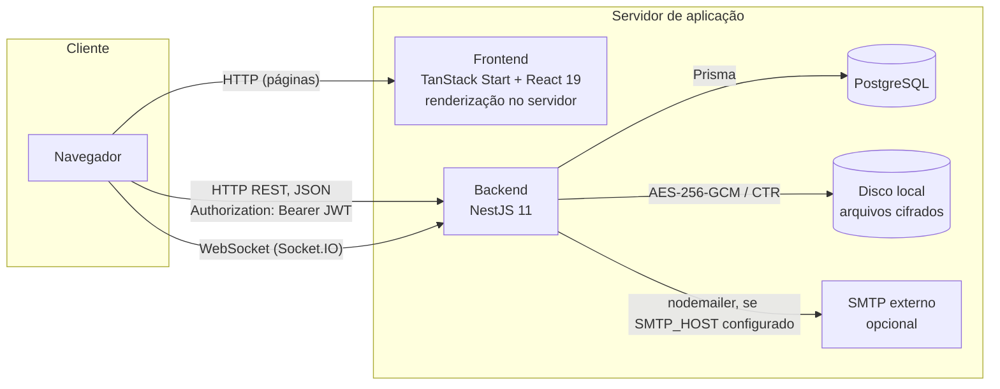
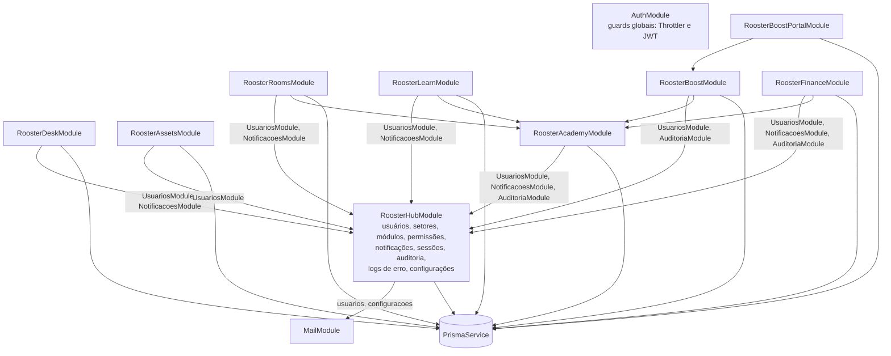
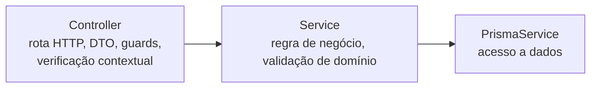
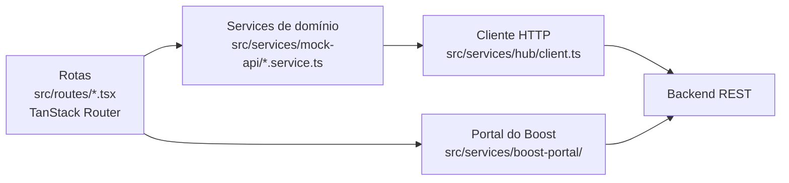

# Arquitetura Geral — Rooster One

## Visão do sistema

O Rooster One é composto por dois processos independentes, que se comunicam exclusivamente por HTTP e WebSocket:

- Não há monorepo nem build compartilhado. O frontend requer apenas que `VITE_API_URL` aponte para um backend
  acessível.
- O frontend utiliza renderização no servidor (TanStack Start com Nitro) e é executado como processo Node próprio;
  as chamadas à API são realizadas pelo navegador, diretamente ao backend.
- O CORS do backend aceita as origens configuradas em `CORS_ORIGINS` e `FRONTEND_URL` e, apenas fora de produção,
  qualquer origem `http://localhost:<porta>` ou `http://127.0.0.1:<porta>` (`src/common/cors.ts`). O mesmo critério
  é aplicado aos gateways WebSocket.
- Não há gateway de API nem balanceador de carga no código; em produção, recomenda-se proxy reverso com HTTPS à
  frente dos dois processos (ver `docs/operations/04-deploy.md`).

## Backend: dependências entre módulos NestJS

**Observação**: todos os módulos de negócio autenticados pelo Hub dependem de `UsuariosModule`, cujo
`UsuariosService.hasPermission()` e `isAdmin()` são utilizados pelo `PermissionGuard` e pelas verificações
contextuais dos controllers. O Hub constitui, portanto, a dependência de autorização de todos os demais módulos. O
Academy, por sua vez, é a referência de turmas, professores e alunos para Rooms, Learn, Boost e Finance. O
`RoosterBoostPortalModule` é o único módulo de negócio que não depende do Hub, por possuir autenticação própria.

## Inicialização da aplicação (`src/main.ts` e `src/app-config.ts`)

- Validação antecipada da chave de cifragem de arquivos (`FILE_ENCRYPTION_KEY`).
- `ValidationPipe` global com `whitelist: true`, `forbidNonWhitelisted: true` e `transform: true`: todo campo não
  declarado no DTO é recusado, e não apenas ignorado.
- Versionamento por URI (`/v1`) e filtro global de exceções (`AllExceptionsFilter`).
- Helmet, log em JSON em produção e Swagger em `/api/docs` (desabilitado em produção, salvo configuração).
- CORS pelo critério de `src/common/cors.ts`, com `credentials: true` e cabeçalhos `Content-Type` e
  `Authorization`.
- Porta: `process.env.PORT ?? 3000`.

## Camadas dos módulos de negócio

Os módulos de negócio seguem o mesmo padrão de três camadas:

Não há camada de repositório: o acesso a dados é realizado pelo service, por meio do `PrismaService`. Detalhes
por módulo em `docs/backend/`.

## Frontend: camadas

Apesar da denominação histórica do diretório `mock-api`, os services de todos os módulos comunicam-se com a API do
backend. O assistente de dúvidas reúne as duas pontas: o chat e o motor dos roteiros guiados residem no frontend
(`src/components/rooster/assistente/`, com estado na raiz da aplicação, para sobreviver à troca de módulo), e a
classificação da pergunta, no backend (`src/assistente/`), sobre a base de conhecimento gerada do Manual do Usuário. O portal do Boost possui cliente e sessão próprios (`src/services/boost-portal/`), em razão da autenticação
independente. Detalhes em `docs/frontend/` no repositório do frontend.
