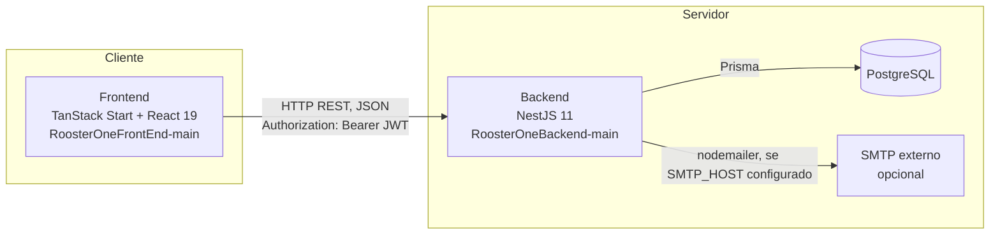
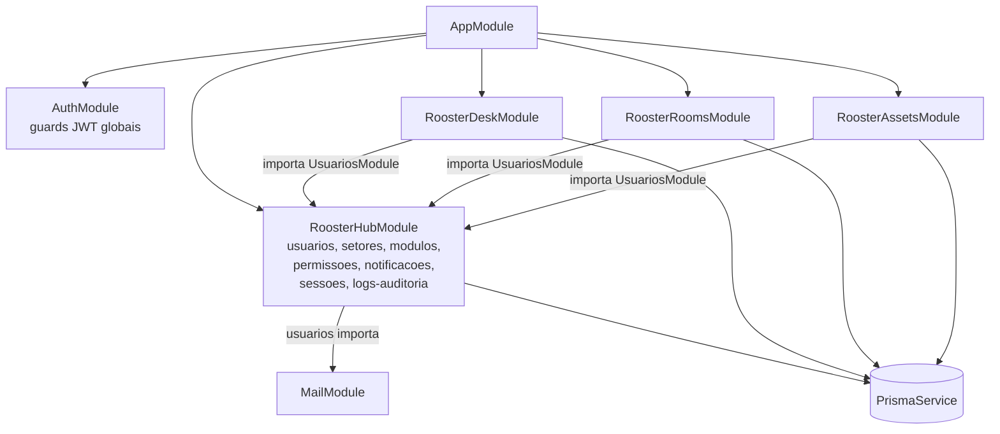
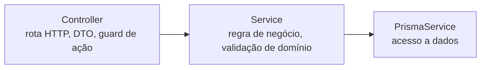
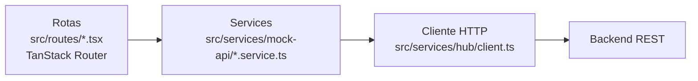

# Arquitetura Geral — Rooster One

## Visão de sistema

O Rooster One é composto por dois processos independentes que só se conhecem por HTTP:

- Não há monorepo, não há build compartilhado. O frontend só precisa que `VITE_API_URL` aponte para um backend acessível.
- CORS do backend aceita qualquer origem `http://localhost:<porta>` ou `http://127.0.0.1:<porta>` (`src/main.ts`) — configuração pensada para desenvolvimento local com porta variável do Vite, não para produção com domínio fixo.
- Sem gateway, sem proxy reverso, sem load balancer identificado no código — a aplicação é servida diretamente pelo processo Node do NestJS (`app.listen`).

## Backend — dependência entre módulos Nest

**Achado relevante**: os três módulos de negócio (Desk, Rooms, Assets) dependem diretamente de `UsuariosModule` do Hub — usam `UsuariosService.hasPermission()`/`isAdmin()` para checar autorização dentro dos próprios controllers, além do `PermissionGuard` global. Ou seja, o Hub não é "só mais um módulo": é a dependência de autorização de todos os outros. Isso está confirmado em `rooster-desk.module.ts`, `rooster-rooms.module.ts` e `rooster-assets.module.ts` (todos importam `UsuariosModule`).

## Bootstrap da aplicação (`src/main.ts`)

- `ValidationPipe` global com `whitelist: true, forbidNonWhitelisted: true, transform: true` — qualquer campo não declarado no DTO é rejeitado, não só ignorado.
- Swagger em `/api/docs`.
- CORS configurado por função (regex de localhost), com `credentials: true` e `allowedHeaders` incluindo `x-user-id` — cabeçalho de um esquema de autenticação anterior (por header de usuário, sem JWT) que não é mais usado pelo fluxo real (login é 100% via `Authorization: Bearer`); ver dívida técnica em `docs/engineering/08-divida-tecnica.md`.
- Porta: `process.env.PORT ?? 3000`.

## Camadas dentro de cada módulo de negócio

Todos os 4 módulos com backend seguem o mesmo padrão de 3 camadas:

Não existe camada de Repository separada — o acesso a dados é feito direto pelo service via `PrismaService`. Detalhe por módulo em `docs/backend/`.

## Frontend — camadas

Apesar do nome histórico "mock-api", os services de Hub/Desk/Rooms/Assets falam com a API real — detalhe em `docs/frontend/`.
