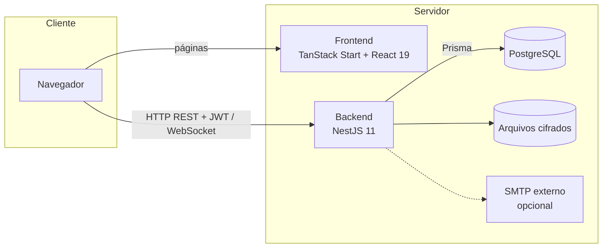
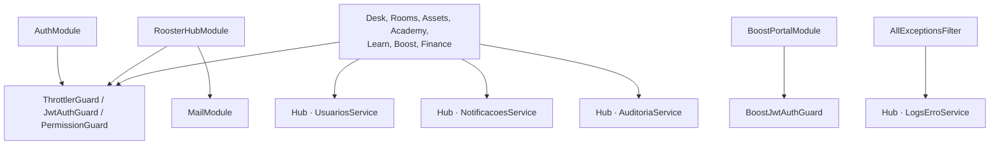
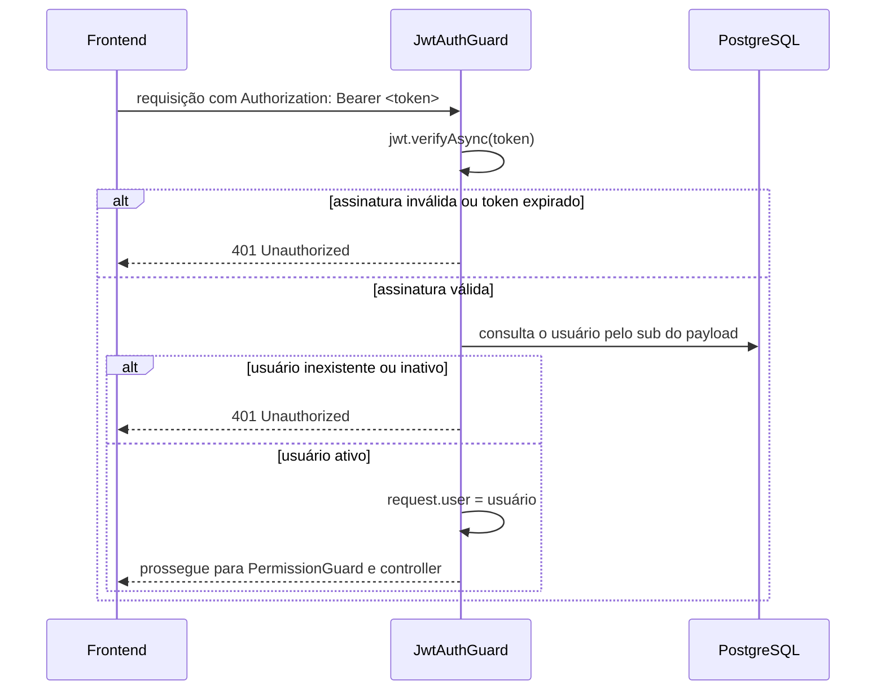
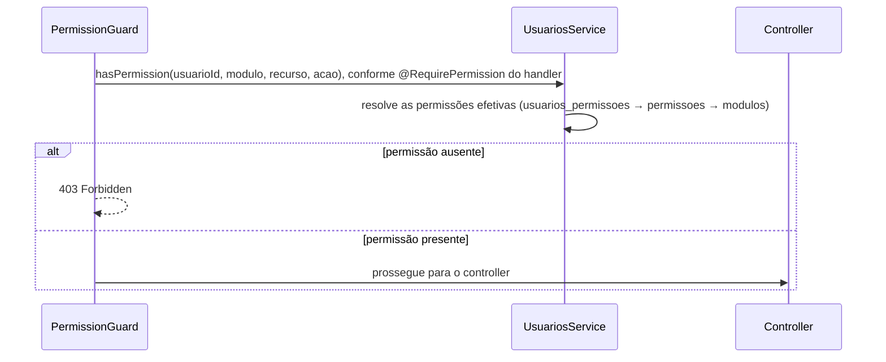
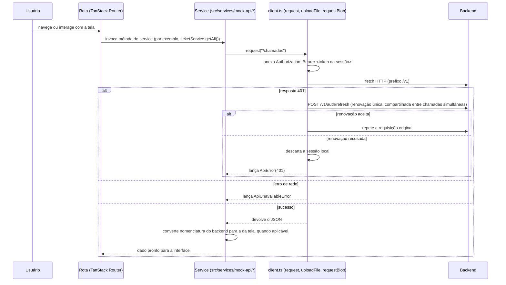
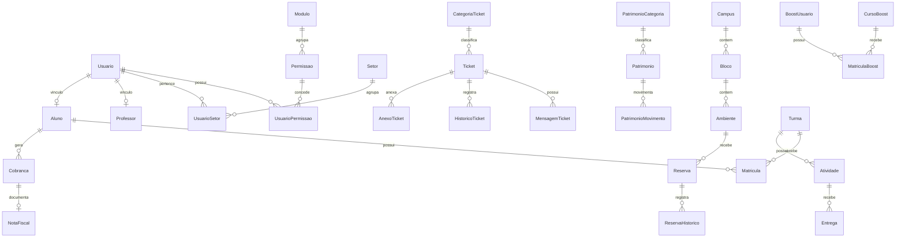

# Diagramas Técnicos — Rooster One

Concentra os diagramas de arquitetura e de fluxos técnicos. Os diagramas de fluxo **funcional** (ciclo de vida de
chamado, reserva e empréstimo) estão em [`docs/system/05-fluxos-do-sistema.md`](../system/05-fluxos-do-sistema.md);
este documento trata da arquitetura e dos mecanismos técnicos. O diagrama ER completo, por entidade, está em
[`docs/database/03-relacionamentos.md`](../database/03-relacionamentos.md).

## Arquitetura do sistema

## Componentes do backend

## Fluxo de autenticação

## Fluxo de autorização

Alguns controllers (Desk, Rooms, Academy, Learn e Finance) realizam verificação adicional no próprio handler, além
do `PermissionGuard`; por exemplo, "o solicitante não pode encerrar o próprio chamado" ou "o gestor ou o responsável
pela reserva". Essas regras residem em métodos como `requireTicketAction`, `requireReservaAccess` e
`exigirDonoOuGestor`, e não no guard genérico.

## Comunicação frontend → backend

## Modelo de dados (visão simplificada)

Visão de orientação, apenas com as entidades centrais de cada módulo; o modelo completo está em
`docs/database/03-relacionamentos.md`.

