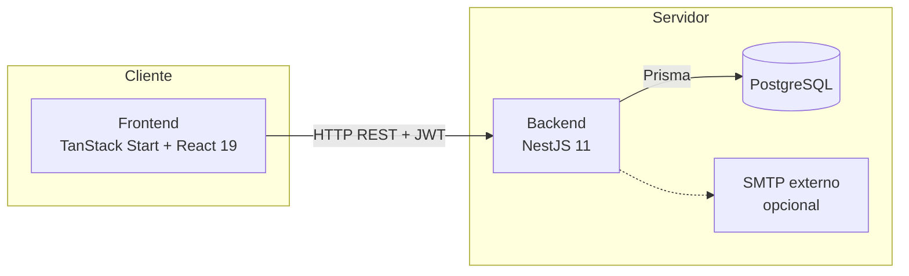
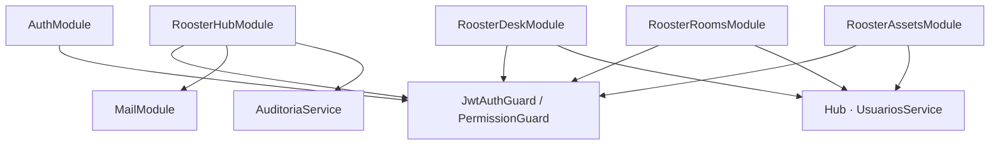
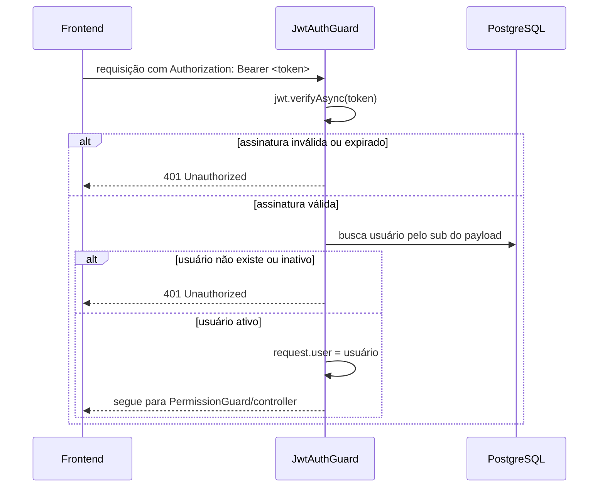
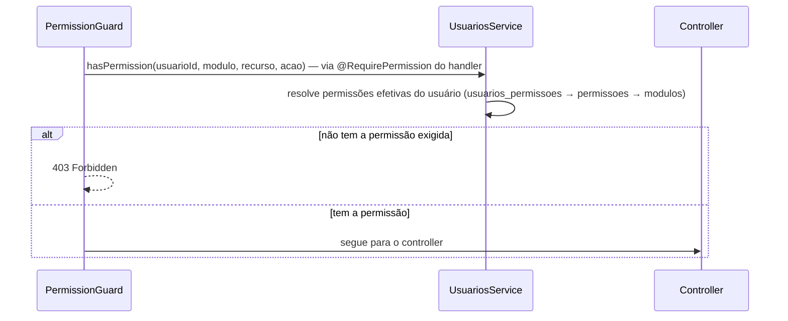
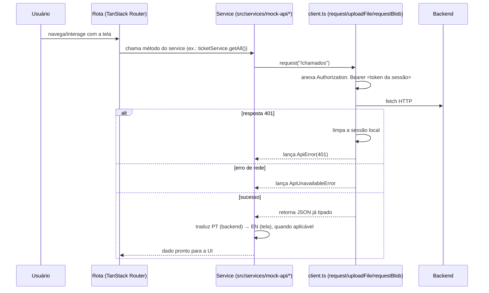
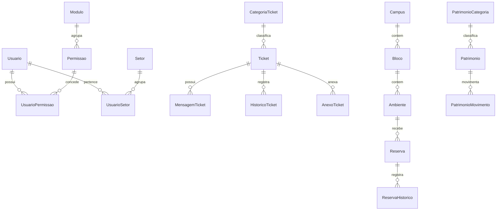

# Diagramas Técnicos — Rooster One

Central de diagramas de arquitetura e fluxos técnicos. Diagramas de fluxo **funcional/negócio** (ciclo de vida de chamado, reserva, empréstimo) ficam em [`docs/system/05-fluxos-do-sistema.md`](../system/05-fluxos-do-sistema.md) — aqui é o nível de arquitetura e mecanismo técnico. O diagrama ER completo, entidade por entidade, fica em [`docs/database/03-relacionamentos.md`](../database/03-relacionamentos.md).

## Arquitetura do sistema

## Componentes do backend

## Fluxo de autenticação

## Fluxo de autorização

Alguns controllers (Desk, Rooms) fazem uma checagem adicional dentro do próprio handler além do `PermissionGuard` — por exemplo, "o solicitante não pode encerrar o próprio chamado" ou "quem gerencia OU é o dono da reserva" — isso não está no guard genérico, está em métodos como `requireTicketAction`/`requireReservaAccess` de cada controller.

## Comunicação Frontend → Backend

## Modelo de dados (visão simplificada)

Visão de orientação só com as entidades centrais de cada módulo — modelo completo em `docs/database/03-relacionamentos.md`.

