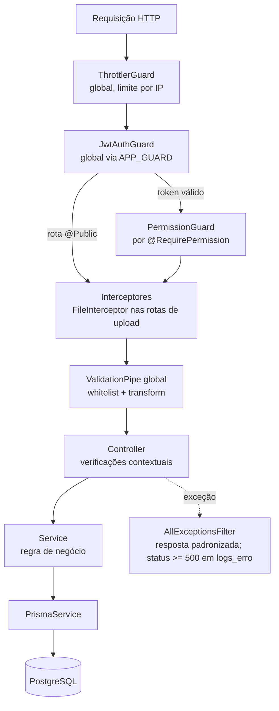
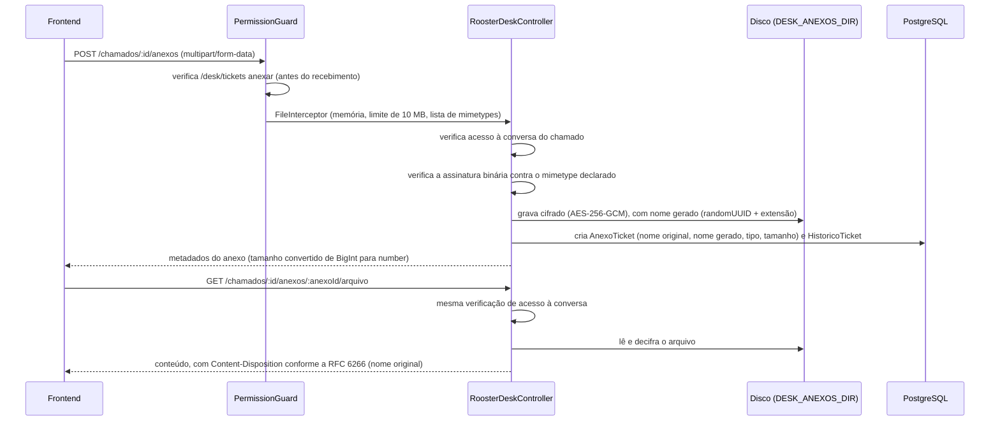

# Fluxos Técnicos — Rooster One

Mecanismos internos que abrangem mais de um módulo. Os fluxos de negócio (perspectiva do usuário) estão em
`docs/system/05-fluxos-do-sistema.md`.

## Processamento de uma requisição HTTP



A ordem segue o ciclo de requisição do NestJS: os **guards** são executados antes dos **interceptores**, e estes
antes dos **pipes**. Consequências: a requisição sem token é recusada (`401`) antes da validação do corpo; o usuário
sem permissão é recusado (`403`) antes do recebimento de arquivo nas rotas de upload; e o corpo malformado ou com
campo não declarado no DTO é recusado (`400`) somente após a autenticação e a autorização.

## Difusão em tempo real da conversa de chamado (WebSocket)

O REST (`POST /chamados/:id/mensagens`) permanece a única fonte de verdade: grava a mensagem, verifica a permissão e
atualiza o histórico. O WebSocket (`MensagensGateway`, namespace `/desk`, Socket.IO) apenas avisa os usuários com o
chamado aberto de que há nova mensagem, para atualização da tela sem recarregamento.

```mermaid
sequenceDiagram
    participant U1 as Usuário A (com o chamado aberto)
    participant WS as MensagensGateway
    participant REST as RoosterDeskController
    participant U2 as Usuário B (remetente)

    U1->>WS: conexão + evento "chamado:entrar" {ticketId}
    WS->>WS: valida origem (CORS) e JWT do handshake; ingressa na sala do ticketId
    U2->>REST: POST /chamados/:id/mensagens
    REST->>REST: verifica permissão; grava mensagem, histórico e notificação (transação)
    REST->>WS: emitirNovaMensagem(ticketId, mensagem)
    WS-->>U1: evento na sala do ticketId
```

**Detalhe de implementação**: a autenticação do socket verifica o JWT em cada handler, e não apenas na conexão,
porque `handleConnection` é assíncrono e o cliente pode emitir o evento seguinte antes de sua conclusão; a
verificação por handler evita que mensagem seja aceita de socket ainda não autenticado. Ver
`src/rooster-desk/mensagens.gateway.ts::autenticar`. O `BoostChatGateway` (namespace `/boost`) segue o mesmo
padrão para as conversas entre aluno e orientadores.

## Upload e download de anexo de chamado



O nome do arquivo em disco nunca é o nome original informado pelo usuário: é sempre um UUID gerado no servidor, o
que impede caminho previsível e sobrescrita por coincidência de nome. O mesmo fluxo aplica-se a documentos
acadêmicos, anexos de entrega e materiais de apoio, com os respectivos limites.

## Transação em múltiplas tabelas

Toda operação que grava em mais de uma tabela como unidade utiliza `$transaction` na forma interativa
(`async (tx) => {...}`), e não a forma de lista de promessas. Exemplos: registro de mensagem de chamado (mensagem,
atualização do chamado, histórico e notificação), movimentação de patrimônio (movimentação e atualização do item),
devolução de empréstimo (marcação da devolução, criação da movimentação e liberação do item), série de reservas
(uma `Reserva` por ocorrência, todas ou nenhuma) e correção de entrega (entrega e nota do Academy).
