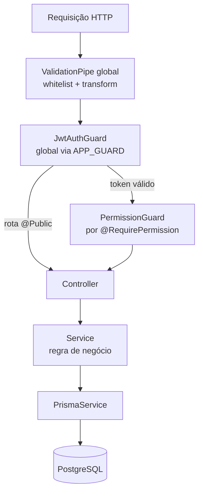
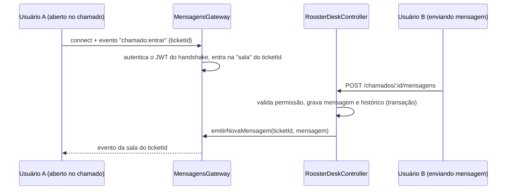
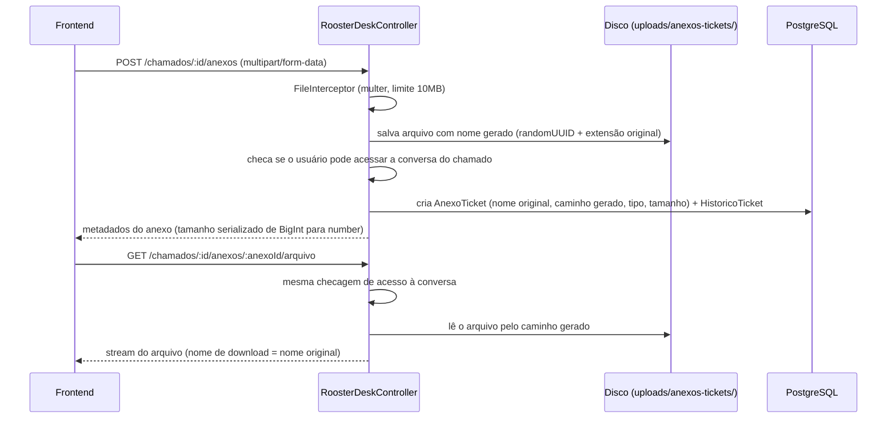

# Fluxos Técnicos — Rooster One

Mecanismos internos que atravessam mais de um módulo. Fluxos de negócio (o que o usuário vê) ficam em `docs/system/05-fluxos-do-sistema.md`.

## Pipeline de uma requisição HTTP

`ValidationPipe` roda antes de qualquer guard — corpo malformado ou com campo não declarado no DTO é rejeitado (400) antes mesmo de checar autenticação.

## Push em tempo real da conversa de chamado (WebSocket)

O REST (`POST /chamados/:id/mensagens`) continua sendo a única fonte de verdade — grava a mensagem, valida permissão, atualiza histórico. O WebSocket (`MensagensGateway`, namespace `/desk`, Socket.IO) só avisa quem está com o chamado aberto que uma mensagem nova chegou, para a tela atualizar sem precisar recarregar.

**Detalhe de implementação relevante**: a autenticação do socket verifica o JWT a cada handler (não só na conexão), porque `handleConnection` é assíncrono e o cliente pode emitir o próximo evento antes dele terminar — evita uma corrida onde uma mensagem seria aceita de um socket ainda não totalmente autenticado. Ver `src/rooster-desk/mensagens.gateway.ts::autenticar`.

## Upload e download de anexo de chamado

O nome do arquivo em disco nunca é o nome original enviado pelo usuário — é sempre um UUID gerado no servidor, para não expor caminho previsível nem permitir sobrescrever outro arquivo por coincidência de nome.

## Transação de múltiplas tabelas

Toda operação que grava em mais de uma tabela como uma unidade usa `$transaction` na forma interativa (`async (tx) => {...}`), nunca a forma de array de promises. Exemplos: registrar mensagem de chamado (mensagem + atualização do chamado + histórico + notificação), registrar movimentação de patrimônio (movimentação + atualização do item), devolver empréstimo (marca devolvido + cria movimentação de devolução + libera o item), criar série de reserva (uma `Reserva` por ocorrência, todas ou nenhuma).
