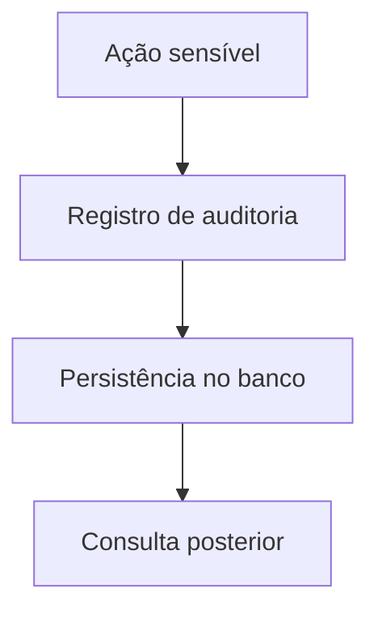

# Fluxo de Auditoria

## Objetivo

Descrever como as ações do sistema devem ser registradas para fins de rastreabilidade.

## Diagrama

## Passos principais

1. Um evento relevante é identificado.
2. O módulo registra o log.
3. O registro permanece disponível para análise e auditoria.
