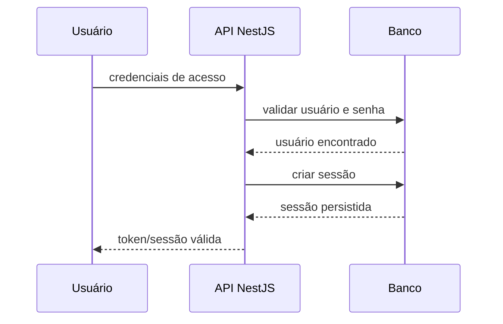

# Fluxo de Autenticação e Sessões

## Objetivo

Descrever o fluxo esperado para autenticação e controle de sessões do sistema.

## Diagrama

## Passos principais

1. O usuário envia credenciais.
2. O backend valida o usuário.
3. Uma sessão é criada e registrada.
4. O contexto da sessão é mantido até expirar ou ser revogada.

## Pontos de evolução

- substituição por JWT real;
- refresh token rotativo;
- controle de logout global.
