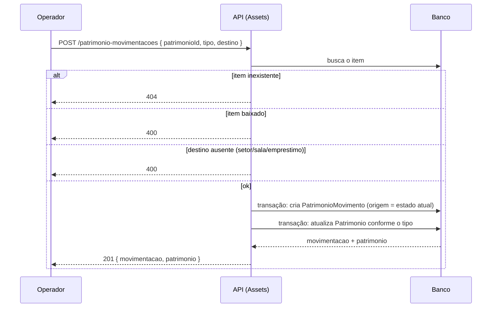

# Fluxo de Movimentação de Patrimônio

## Objetivo

Descrever como uma movimentação de patrimônio é registrada e como ela mantém o
estado do item atualizado, no Rooster Assets.

## Diagrama

## Passos principais

1. O operador escolhe o item, o tipo de movimentação e o destino.
2. A API valida: item existe, não está baixado, destino informado quando exigido.
3. Numa transação, a movimentação é criada (com `origem` = estado atual do item)
   e o item é atualizado conforme o tipo ([RN009](../regras-negocio/RN009-movimentacao-patrimonio.md)).
4. A resposta traz a movimentação e o item já atualizado.

## Baixa

`PATCH /patrimonio/:id/baixa` segue o mesmo padrão transacional: registra uma
movimentação de tipo `baixa` com o motivo e passa o item para `status = baixado`.
A partir daí o item não aceita mais movimentações.

## Integrações

- `Patrimonio.setorId` / `responsavelUserId` → Rooster Hub;
- `Patrimonio.chamadoManutencaoId` → Rooster Desk (vínculo manual por enquanto).
