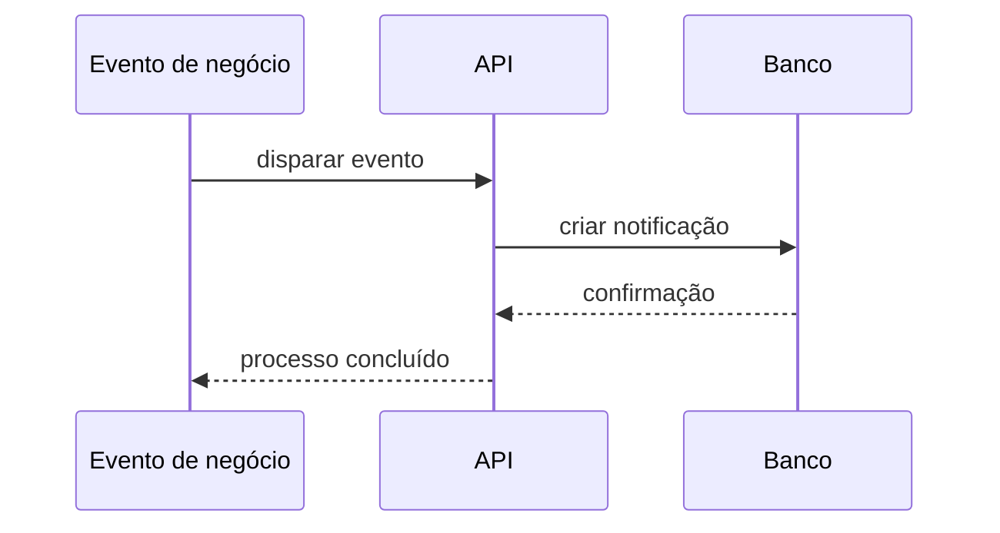

# Fluxo de Notificações

## Objetivo

Descrever como eventos do sistema podem gerar notificações para os usuários.

## Diagrama

## Passos principais

1. Um evento relevante ocorre.
2. O backend cria uma notificação.
3. A mensagem fica disponível para visualização e posterior leitura.
