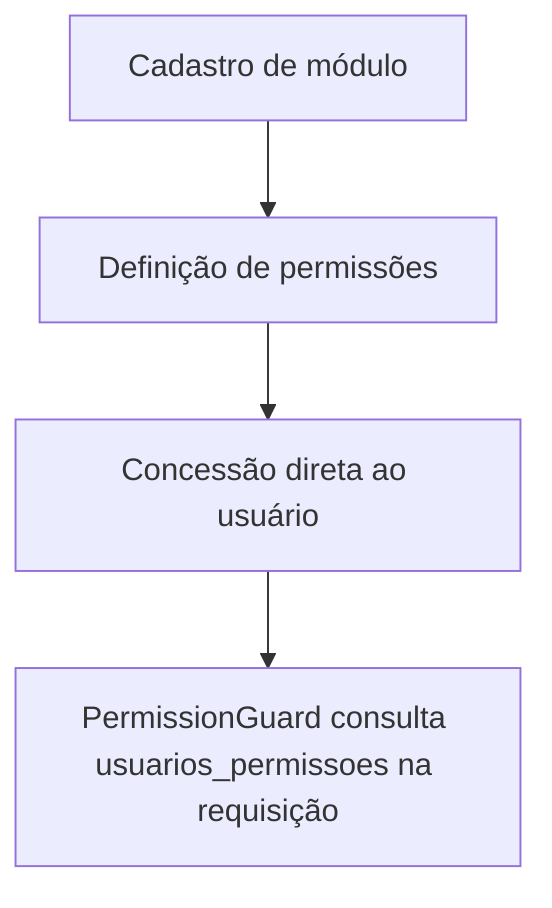

# Fluxo de Gestão de Permissões

## Objetivo

Descrever a criação de módulos/permissões e a concessão direta a um usuário
— não existe mais Perfil como intermediário.

## Diagrama

## Passos principais

1. O módulo é cadastrado (`POST /modulos`) — ex.: `Rooster Desk`.
2. As permissões são criadas (`POST /permissoes`), cada uma com
   `recurso` = rota da tela no frontend e `acao` = id da ação; a tela
   `/hub/acessos` também cria esses registros sob demanda ao conceder acesso.
3. Um administrador concede a permissão ao usuário
   (`POST /usuarios-permissoes`).
4. Em toda requisição, o `PermissionGuard` chama
   `UsuariosService.hasPermission(usuarioId, modulo, recurso, acao)`, que lê
   `usuarios_permissoes` direto — sem join por perfil.
