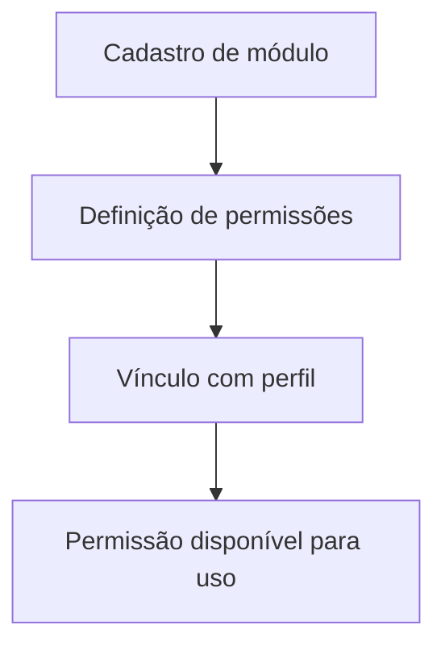

# Fluxo de Gestão de Permissões

## Objetivo

Descrever a criação e vinculação de permissões a perfis e módulos.

## Diagrama

## Passos principais

1. O módulo é cadastrado.
2. As permissões associadas são criadas.
3. O perfil recebe as permissões.
4. O acesso é então determinado por esse conjunto.
