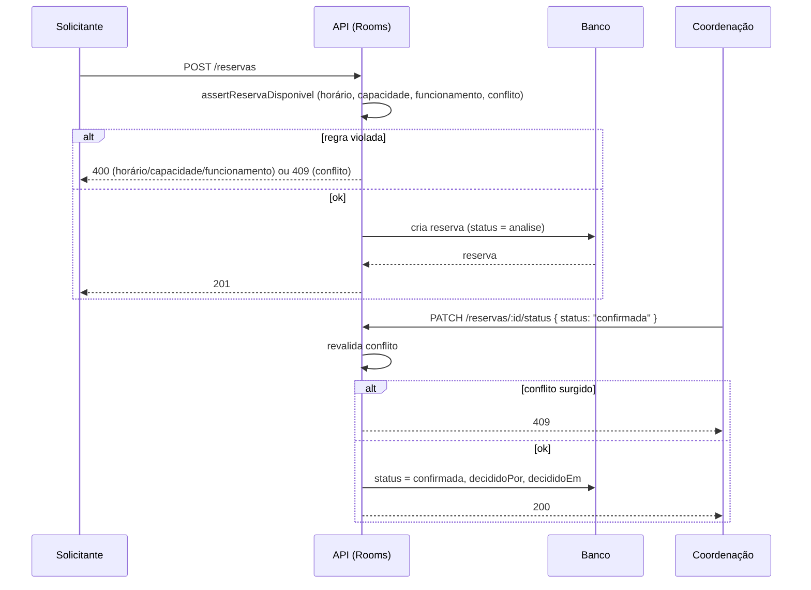

# Fluxo de Reservas de Ambientes

## Objetivo

Descrever o ciclo de vida de uma reserva de ambiente no Rooster Rooms, da
solicitação à decisão da coordenação.

## Diagrama

## Passos principais

1. O solicitante escolhe ambiente, data e horário e envia a reserva.
2. A API valida contra as regras do ambiente ([RN008](../regras-negocio/RN008-reservas-ambientes.md)).
   Falha → `400` ou `409`; sucesso → reserva criada em `analise`.
3. A coordenação lista as reservas em análise e aprova ou recusa.
4. Ao aprovar, a API revalida o conflito e grava quem decidiu e quando.
5. `GET /ambientes/:id/disponibilidade` pode ser consultado a qualquer momento
   para ver os horários livres do ambiente na data.

## Integrações

- `Reserva.decididoPor` → usuário do Rooster Hub;
- `Reserva.setorId` → setor do Rooster Hub (opcional);
- notificação ao solicitante sobre a decisão: trabalho futuro.
