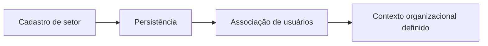

# Fluxo de Gestão de Setores e Vinculações

## Objetivo

Descrever o cadastro de setores e a associação de usuários a essas estruturas organizacionais.

## Diagrama

## Passos principais

1. O setor é criado.
2. O usuário é associado ao setor.
3. O sistema passa a considerar esse vínculo no contexto organizacional.
