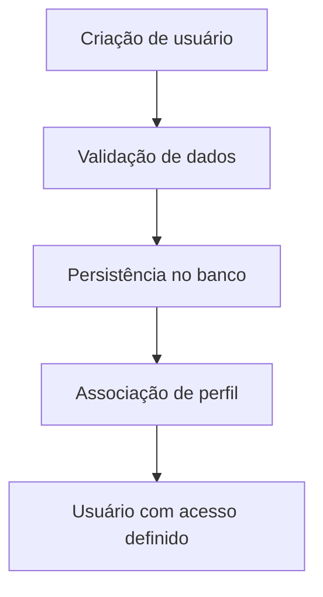

# Fluxo de Gestão de Usuários e Perfis

## Objetivo

Descrever a criação de usuários e a associação de perfis funcionais.

## Diagrama

## Passos principais

1. O usuário é criado.
2. O sistema valida dados básicos.
3. O vínculo com perfis é definido.
4. O acesso é determinado pela combinação de perfil e permissões.
