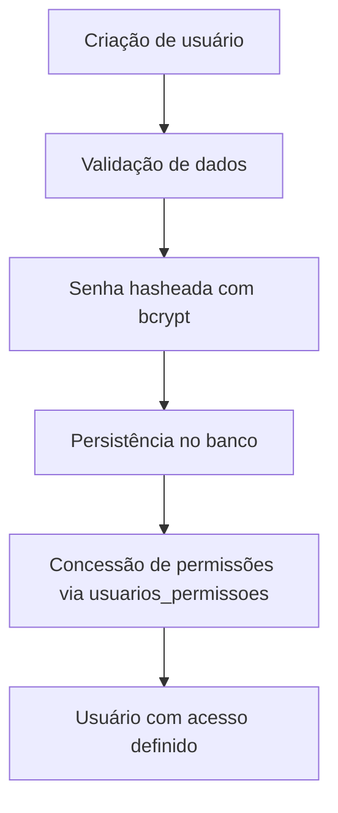

# Fluxo de Gestão de Usuários e Permissões

## Objetivo

Descrever a criação de usuários e a concessão de permissões diretas (sem
Perfil intermediário).

## Diagrama

## Passos principais

1. O usuário é criado (`POST /usuarios`); a senha é hasheada antes de salvar.
2. O sistema valida dados básicos (DTO com `class-validator`).
3. Um administrador concede permissões individuais (`POST
   /usuarios-permissoes`) — cada uma no formato `modulo/recurso/acao`.
4. No login, o backend assina um JWT (`POST /auth/login`); o acesso efetivo é
   sempre calculado na hora (`UsuariosService.getAccess`), nunca cacheado no
   token.

Ver [rbac.md](../rbac.md) para o fluxo completo, incluindo exemplos de
requisição.
