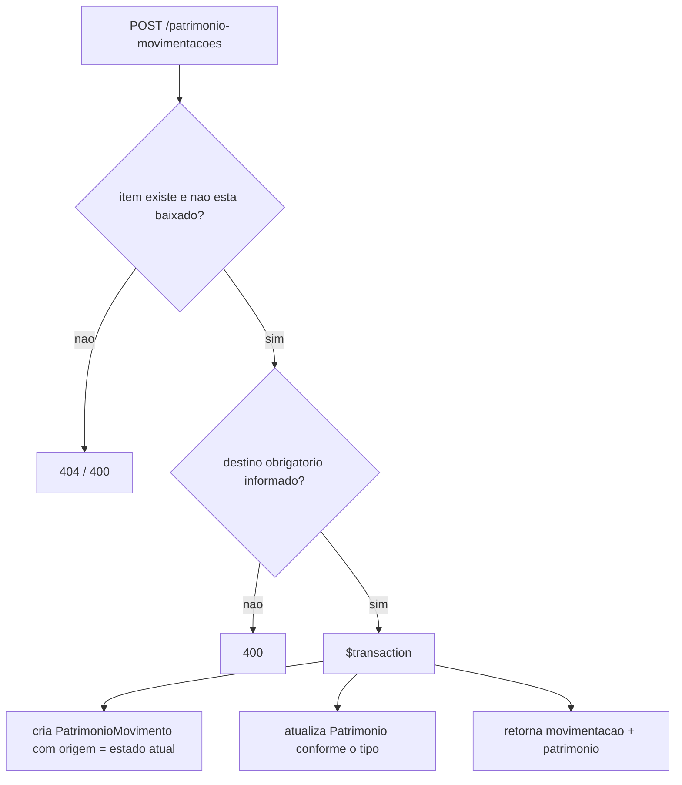

# Módulo Rooster Assets

## Objetivo

Controlar o patrimônio da instituição — itens, sua categorização, o setor
responsável e o histórico de movimentações — mantendo o estado do item sempre
coerente com a última movimentação registrada.

## Responsabilidades

- cadastrar categorias e setores de patrimônio;
- cadastrar itens (patrimônios) com tag única, valor e condição;
- registrar movimentações (mudança de sala, mudança de setor, empréstimo,
  devolução, manutenção) e atualizar o item na mesma operação;
- dar baixa em um item, registrando o motivo no histórico.

## Entidades pertencentes

- `PatrimonioCategoria` (`patrimonio_categorias`)
- `PatrimonioSetor` (`patrimonio_setores`)
- `Patrimonio` (`patrimonio`)
- `PatrimonioMovimento` (`patrimonio_movimentacoes`)

## Relacionamentos com outros módulos

- `Patrimonio N—1 PatrimonioCategoria` (obrigatório);
- `Patrimonio N—1 PatrimonioSetor` (opcional);
- `Patrimonio 1—N PatrimonioMovimento` (exclusão em cascata);
- `Patrimonio.responsavelUserId` e `Patrimonio.setorId` podem referenciar
  usuários e setores do Rooster Hub;
- `Patrimonio.chamadoManutencaoId` pode referenciar um chamado do Rooster Desk.

## Fluxo de funcionamento

## Principais endpoints

| Método | Endpoint | Descrição |
| --- | --- | --- |
| POST / GET / GET :id / PATCH :id / DELETE :id | `/patrimonio-categorias` | CRUD de categorias |
| POST / GET / GET :id / PATCH :id / DELETE :id | `/patrimonio-setores` | CRUD de setores de patrimônio |
| POST / GET / GET :id / PATCH :id / DELETE :id | `/patrimonio` | CRUD de itens (`?categoriaId=&setorId=&status=`) |
| PATCH | `/patrimonio/:id/baixa` | Dá baixa no item (`{ motivo?, usuario? }`) |
| POST / GET / GET :id / PATCH :id / DELETE :id | `/patrimonio-movimentacoes` | Movimentações (`?patrimonioId=`) |

## Campos relevantes

### Patrimonio (`patrimonio`)

- `tag`: string **única**; conflito retorna `409`.
- `status`: `disponivel`, `em-uso`, `emprestado`, `manutencao`, `baixado`.
- `condicao`: `novo`, `bom`, `regular`, `ruim`, `inservivel`.
- `adquiridoEm`: data ISO (obrigatória); `valor`: decimal com até 2 casas.
- `setor` / `localizacao` / `responsavel`: texto livre, mantido em sincronia
  pelas movimentações; `setorId` / `responsavelUserId`: FKs opcionais.

### PatrimonioMovimento (`patrimonio_movimentacoes`)

- `tipo`: `setor`, `sala`, `emprestimo`, `devolucao`, `manutencao` (via
  `/patrimonio-movimentacoes`) e `baixa` (via `/patrimonio/:id/baixa`).
- `origem`: preenchida automaticamente com o estado atual do item;
- `destino`: obrigatório para `setor`, `sala` e `emprestimo`;
- `usuario`: nome de quem registrou; `observacoes`: texto livre / motivo da baixa.

## Regras de negócio relacionadas

Ver [RN009 - Movimentação e baixa de patrimônio](../regras-negocio/RN009-movimentacao-patrimonio.md).

- a movimentação e a atualização do item acontecem na **mesma transação**;
- efeito de cada tipo sobre o item:

  | Tipo | Efeito no `Patrimonio` |
  | --- | --- |
  | `sala` | `localizacao = destino` |
  | `setor` | `setor = destino` |
  | `emprestimo` | `status = emprestado`, `responsavel = destino` |
  | `devolucao` | `status = disponivel`, `responsavel = null` |
  | `manutencao` | `status = manutencao` |
  | `baixa` | `status = baixado` |

- item com `status = baixado` não pode ser movimentado (`400`);
- tag duplicada em qualquer criação retorna `409` com o nome do campo.

## Dependências

- Prisma Client (`PrismaService` compartilhado);
- `JwtAuthGuard` global.

## Funcionalidades futuras

- autorização por permissão (hoje qualquer usuário autenticado opera o módulo);
- `409` (em vez de `500`) ao excluir categoria que ainda tem itens;
- anexar comprovantes/nota fiscal ao item;
- relatório de depreciação a partir de `valor` e `adquiridoEm`;
- vínculo automático com o chamado de manutenção do Rooster Desk.

## Observações técnicas

`createMovement` e `baixaAsset` usam `prisma.$transaction([...])` e devolvem
`{ movimentacao, patrimonio }`, para o cliente refletir o novo estado sem uma
segunda chamada. `updateAsset` monta o `data` campo a campo (não espalha o DTO)
para não enviar `categoriaId` junto com a relação `categoria`, o que o Prisma
rejeita.
