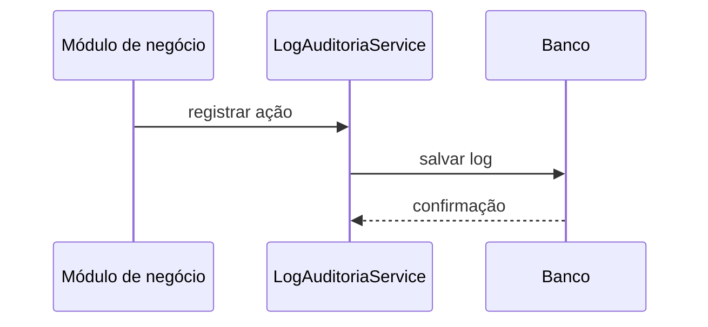

# Módulo Logs de Auditoria

## Objetivo

Registrar ações importantes realizadas no sistema para rastreabilidade e governança.

## Responsabilidades

- registrar eventos e ações do sistema;
- manter contexto de usuário, módulo e entidade;
- apoiar auditoria e investigação.

## Entidades pertencentes

- LogAuditoria

## Relacionamentos com outros módulos

- depende de Usuario e está ligado a ações de outros módulos.

## Fluxo de funcionamento

## Principais endpoints

| Método | Endpoint | Descrição |
| --- | --- | --- |
| POST | /logs-auditoria | Cria um registro |
| GET | /logs-auditoria | Lista logs |
| GET | /logs-auditoria/:id | Busca um log |
| PATCH | /logs-auditoria/:id | Atualiza um log |
| DELETE | /logs-auditoria/:id | Remove um log |

## Dependências

- Prisma Client
- módulo de usuários

## Regras de negócio relacionadas

- registros de auditoria devem ser imutáveis ou de difícil alteração;
- contexto de usuário e ação deve ser preservado.

## Funcionalidades futuras

- filtragem por data, módulo e usuário;
- exportação para análise.

## Observações técnicas

A estrutura atual já oferece uma boa base para auditoria, mas pode ser ampliada com metadados e políticas de retenção.
