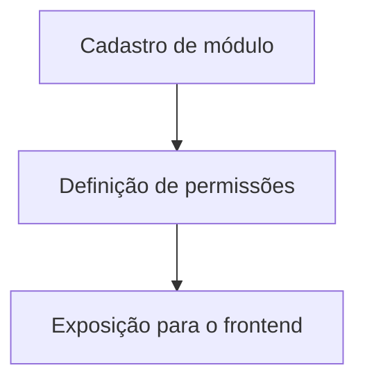

# Módulo Módulos

## Objetivo

Descrever os módulos e recursos do sistema que podem estar associados a permissões e navegação.

## Responsabilidades

- registrar recursos do sistema;
- categorizar módulos operacionais;
- servir como referência para permissões e navegação.

## Entidades pertencentes

- Modulo
- Permissao

## Relacionamentos com outros módulos

- cada módulo pode ter várias permissões;
- permissões podem ser agrupadas por recurso e ação.

## Fluxo de funcionamento

## Principais endpoints

| Método | Endpoint | Descrição |
| --- | --- | --- |
| POST | /modulos | Cria um módulo |
| GET | /modulos | Lista módulos |
| GET | /modulos/:id | Busca um módulo |
| PATCH | /modulos/:id | Atualiza um módulo |
| DELETE | /modulos/:id | Remove um módulo |

## Dependências

- Prisma Client
- módulo de permissões

## Regras de negócio relacionadas

- módulos devem possuir nome único e rota clara;
- módulos desativados não devem ser exibidos em navegação ativa;
- permissões vinculadas ao módulo formam a unidade de acesso consultada pelo Hub.

## Funcionalidades futuras

- menu dinâmico baseado em permissões;
- agrupamento por categorias.

## Observações técnicas

Este módulo já está integrado ao frontend Hub e pode ser consultado no acesso
efetivo de um usuário. A aplicação automática de RBAC permanece planejada.
