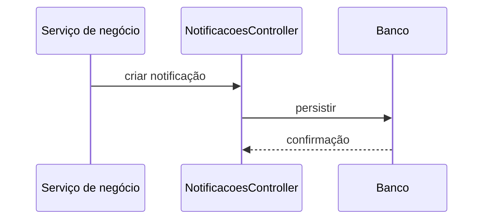

# Módulo Notificações

## Objetivo

Registrar mensagens internas ou avisos destinados a usuários específicos.

## Responsabilidades

- criar notificações;
- marcar como lida ou não lida;
- associar mensagens a usuários.

## Entidades pertencentes

- Notificacao

## Relacionamentos com outros módulos

- depende de Usuario.

## Fluxo de funcionamento

## Principais endpoints

| Método | Endpoint | Descrição |
| --- | --- | --- |
| POST | /notificacoes | Cria uma notificação |
| GET | /notificacoes | Lista notificações |
| GET | /notificacoes/:id | Busca uma notificação |
| PATCH | /notificacoes/:id | Atualiza uma notificação |
| DELETE | /notificacoes/:id | Remove uma notificação |

## Dependências

- Prisma Client
- módulo de usuários

## Regras de negócio relacionadas

- notificações devem ter título e mensagem claros;
- o estado de leitura deve ser controlado explicitamente.

## Funcionalidades futuras

- envio por e-mail ou push;
- agrupamento por categoria e prioridade.

## Observações técnicas

O módulo já está bem preparado para evoluir para um canal de comunicação mais amplo.
