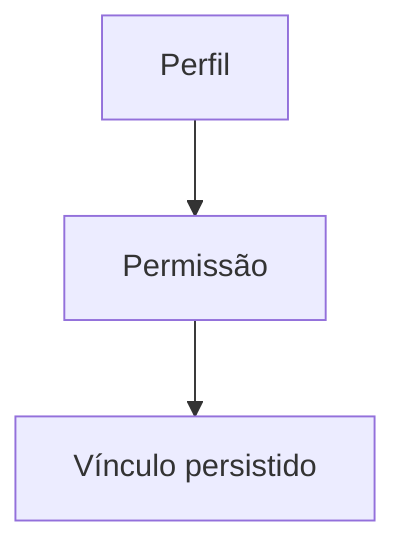

# Módulo Perfis-Permissões

## Objetivo

Relacionar perfis a permissões específicas, materializando a base da autorização.

## Responsabilidades

- definir quais permissões cada perfil possui;
- manter a configuração de acesso do sistema.

## Entidades pertencentes

- PerfilPermissao

## Relacionamentos com outros módulos

- depende de Perfil e Permissao.

## Fluxo de funcionamento

## Principais endpoints

| Método | Endpoint | Descrição |
| --- | --- | --- |
| POST | /perfis-permissoes | Cria vínculo |
| GET | /perfis-permissoes | Lista vínculos |
| GET | /perfis-permissoes/:id | Busca vínculo |
| PATCH | /perfis-permissoes/:id | Atualiza vínculo |
| DELETE | /perfis-permissoes/:id | Remove vínculo |

## Dependências

- perfis e permissões

## Regras de negócio relacionadas

- uma permissão pode ser adicionada a múltiplos perfis;
- o vínculo deve ser consistente com o contexto do módulo.

## Funcionalidades futuras

- atualização por pacote;
- análise de impacto de permissões.

## Observações técnicas

Este módulo é um dos pilares de uma futura camada de autorização robusta.
