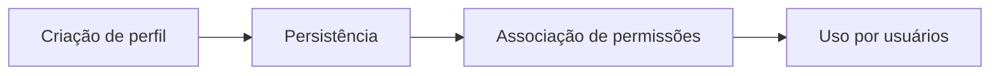

# Módulo Perfis

## Objetivo

Representar grupos funcionais do sistema para classificação de usuários e associação de permissões.

## Responsabilidades

- criar e manter perfis;
- manter relação com permissões;
- auxiliar na autorização futura.

## Entidades pertencentes

- Perfil
- UsuarioPerfil
- PerfilPermissao

## Relacionamentos com outros módulos

- perfis são associados a usuários;
- perfis recebem permissões;
- perfis podem ser usados como base para RBAC.

## Fluxo de funcionamento

## Principais endpoints

| Método | Endpoint | Descrição |
| --- | --- | --- |
| POST | /perfis | Cria um perfil |
| GET | /perfis | Lista perfis |
| GET | /perfis/:id | Busca um perfil |
| PATCH | /perfis/:id | Atualiza um perfil |
| DELETE | /perfis/:id | Remove um perfil |

## Dependências

- Prisma Client
- módulo de perfis-permissoes

## Regras de negócio relacionadas

- um perfil deve ter nome claro e identificável;
- perfis ativos devem poder ser atribuídos a usuários.

## Funcionalidades futuras

- hierarquias entre perfis;
- herança de permissões;
- regras temporárias de atribuição.

## Observações técnicas

Este módulo é a base estrutural para a futura implementação de autorização e controle de acesso.
