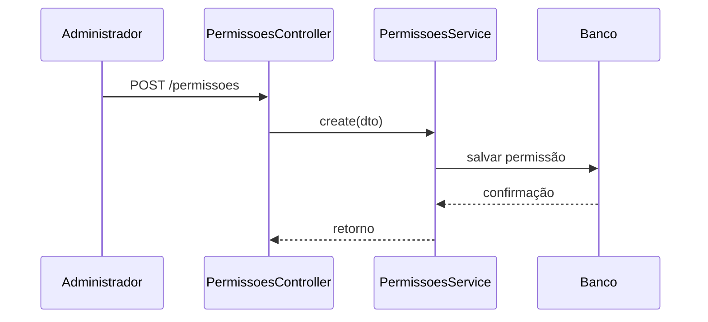

# Módulo Permissões

## Objetivo

Definir as ações e recursos que podem ser autorizados dentro do sistema.

## Responsabilidades

- criar permissões granulares;
- associar permissões a perfis;
- servir de base para autorização.

## Entidades pertencentes

- Permissao
- PerfilPermissao

## Relacionamentos com outros módulos

- uma permissão pode ser vinculada a vários perfis;
- uma permissão está associada a um módulo.

## Fluxo de funcionamento

## Principais endpoints

| Método | Endpoint | Descrição |
| --- | --- | --- |
| POST | /permissoes | Cria uma permissão |
| GET | /permissoes | Lista permissões |
| GET | /permissoes/:id | Busca uma permissão |
| PATCH | /permissoes/:id | Atualiza uma permissão |
| DELETE | /permissoes/:id | Remove uma permissão |

## Dependências

- Prisma Client
- módulo de perfis-permissoes

## Regras de negócio relacionadas

- cada permissão deve refletir um recurso e uma ação claros;
- `moduloId`, `perfilId` e `permissaoId` devem ser UUIDs válidos;
- vínculos duplicados são impedidos por índices únicos no banco.

## Funcionalidades futuras

- guards e autorização automática por endpoint;
- avaliação dinâmica de acesso em cada requisição.

## Observações técnicas

Este módulo fornece o catálogo necessário para RBAC e já participa da consulta
de acesso efetivo do usuário. O bloqueio automático das rotas ainda não está
ativado.
