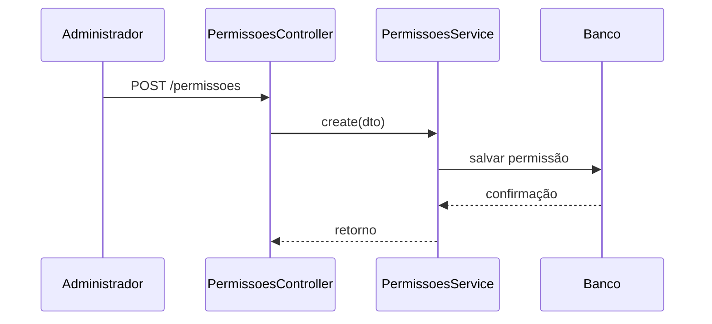

# Módulo Permissões

## Objetivo

Definir as ações e recursos que podem ser autorizados dentro do sistema.

## Responsabilidades

- criar permissões granulares (`modulo` / `recurso` / `acao`);
- ser concedida diretamente a usuários via `usuarios-permissoes`;
- servir de base para o `PermissionGuard`.

## Entidades pertencentes

- Permissao
- UsuarioPermissao (ver [Usuários-Permissões](usuarios-permissoes.md))

## Relacionamentos com outros módulos

- uma permissão pode ser concedida a vários usuários;
- uma permissão está associada a um módulo.

## Fluxo de funcionamento

## Principais endpoints

| Método | Endpoint | Descrição |
| --- | --- | --- |
| POST | /permissoes | Cria uma permissão |
| GET | /permissoes | Lista permissões |
| GET | /permissoes/:id | Busca uma permissão |
| PATCH | /permissoes/:id | Atualiza uma permissão |
| DELETE | /permissoes/:id | Remove uma permissão |

## Dependências

- Prisma Client
- módulo de usuários-permissões

## Regras de negócio relacionadas

- cada permissão deve refletir um recurso (rota da tela) e uma ação claros;
- `moduloId` e `permissaoId` devem ser UUIDs válidos;
- vínculos duplicados (`usuarioId` + `permissaoId`) são impedidos por índice
  único no banco.

## Observações técnicas

Este módulo fornece o catálogo usado pelo `PermissionGuard`, registrado
globalmente — o bloqueio automático das rotas por `@RequirePermission` já
está ativo em Hub, Desk, Rooms e Assets (ver [rbac.md](../rbac.md)).
