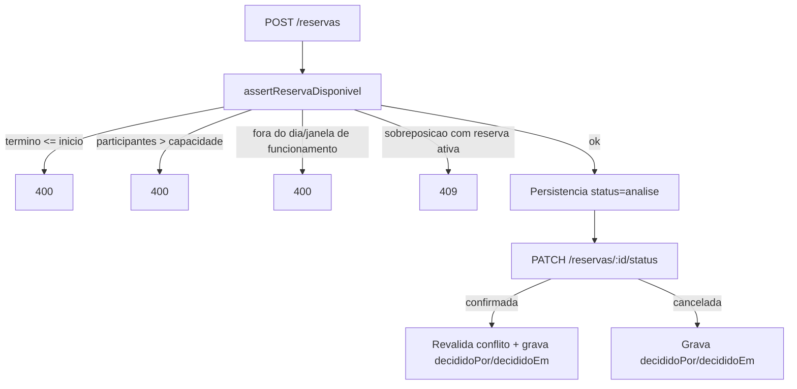

# Módulo Rooster Rooms

## Objetivo

Gerenciar os espaços físicos da instituição e as reservas desses espaços, com
validação automática de conflito de horário e um fluxo de aprovação.

## Responsabilidades

- cadastrar a estrutura física em três níveis: campus, blocos e ambientes;
- registrar reservas de ambientes e validá-las contra as regras do ambiente;
- controlar o ciclo de vida da reserva (análise → confirmada / cancelada);
- calcular a disponibilidade de horários de um ambiente em uma data.

## Entidades pertencentes

- `Campus` (`campus`)
- `Bloco` (`blocos`)
- `Ambiente` (`ambientes`)
- `Reserva` (`reservas`)

## Relacionamentos com outros módulos

- `Campus 1—N Bloco`, `Bloco 1—N Ambiente` (exclusão em cascata);
- `Ambiente 1—N Reserva` (exclusão com `Restrict`: não se apaga um ambiente com reservas);
- `Reserva.decididoPor` referencia o `id` do usuário que aprovou ou recusou (Rooster Hub);
- `Reserva.setorId` referencia opcionalmente um setor do Rooster Hub.

## Fluxo de funcionamento

## Principais endpoints

| Método | Endpoint | Descrição |
| --- | --- | --- |
| POST / GET / GET :id / PATCH :id / DELETE :id | `/campus` | CRUD de campus |
| POST / GET / GET :id / PATCH :id / DELETE :id | `/blocos` | CRUD de blocos (`?campusId=` na listagem) |
| POST / GET / GET :id / PATCH :id / DELETE :id | `/ambientes` | CRUD de ambientes (`?campusId=&blocoId=&tipo=&status=`) |
| GET | `/ambientes/estrutura` | Árvore campus → blocos → ambientes |
| GET | `/ambientes/:id/disponibilidade?data=YYYY-MM-DD` | Horários livres do ambiente na data |
| POST / GET / GET :id / PATCH :id / DELETE :id | `/reservas` | CRUD de reservas (`?ambienteId=&data=&status=`) |
| PATCH | `/reservas/:id/status` | Aprova (`confirmada`), recusa (`cancelada`) ou altera o status |

## Campos relevantes

### Ambiente (`ambientes`)

- `tipo`: `sala`, `lab`, `lab-info`, `auditorio`, `biblioteca`, `reuniao`, `ginasio`, `quadra`, `anfiteatro`, `multiuso`, `estudio`, `outro`.
- `capacidade`: inteiro. Quando maior que zero, limita `participantes` da reserva.
- `horarioAbertura`: string `"HH:MM-HH:MM"` (ou `"HH:MM"`); define a janela de funcionamento. Padrão assumido: `07:00–22:00`.
- `diasFuncionamento`: lista de dias (`seg`, `ter`, ...). Vazia = funciona todos os dias.
- `duracaoMinutos`: tamanho do slot usado no cálculo de disponibilidade (padrão 60).

### Reserva (`reservas`)

- `codigo`: string única, gerada pelo cliente (ex.: `RES-0001`).
- `status`: `analise` (padrão), `confirmada`, `andamento`, `finalizada`, `cancelada`.
- `decididoPor` / `decididoEm`: preenchidos automaticamente ao confirmar ou cancelar.
- `data`: data (sem hora); `horarioInicio` / `horarioFim`: strings `"HH:MM"`.

## Regras de negócio relacionadas

Ver [RN008 - Reservas de ambientes](../regras-negocio/RN008-reservas-ambientes.md).

- término deve ser depois do início;
- `participantes` não pode exceder a capacidade do ambiente;
- a reserva deve cair em um dia e dentro da janela de funcionamento do ambiente;
- não pode haver sobreposição de horário com outra reserva **ativa** do mesmo
  ambiente — status ativos: `analise`, `confirmada`, `andamento`;
- ao **confirmar**, o conflito é revalidado (outra reserva pode ter sido
  confirmada nesse intervalo);
- `origem` e `destino` das mudanças de status ficam registrados via `decididoPor`
  e `decididoEm`.

## Cálculo de disponibilidade

`GET /ambientes/:id/disponibilidade` monta os slots de `duracaoMinutos` dentro da
janela de funcionamento e remove os que colidem com reservas ativas do dia.
Retorna `{ funcionando, janela, duracaoMinutos, horariosDisponiveis[], ocupados[] }`.
Se o ambiente não funciona no dia, retorna `funcionando: false` com lista vazia.

## Dependências

- Prisma Client (`PrismaService` compartilhado com o Rooster Hub);
- `JwtAuthGuard` global (todas as rotas exigem Bearer JWT).

## Funcionalidades futuras

- autorização por permissão (hoje qualquer usuário autenticado opera o módulo);
- cancelar reserva já confirmada e registrar o motivo;
- notificar o solicitante da decisão (integração com Notificações);
- recorrência real (as reservas recorrentes são hoje registros únicos);
- integração da localização de patrimônio com o ambiente.

## Observações técnicas

As regras ficam concentradas em `assertReservaDisponivel` (privado), reutilizado
por `createReserva`, `updateReserva` e pela confirmação em `updateReservaStatus`.
A comparação de sobreposição usa minutos desde a meia-noite; encostar
(`10:00–11:00` seguido de `11:00–12:00`) não é conflito.
