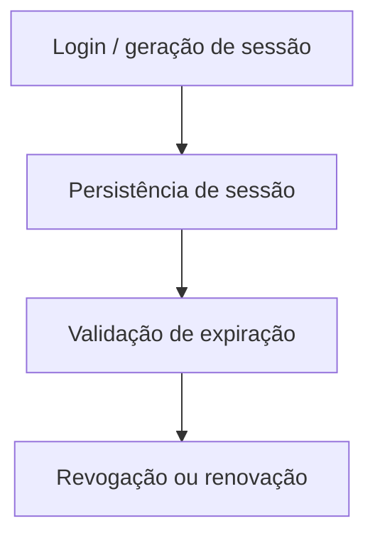

# Módulo Sessões

## Objetivo

Gerenciar sessões de acesso e refresh tokens associados a usuários.

## Responsabilidades

- registrar sessões ativas;
- controlar revogação;
- manter informações do contexto da sessão.

## Entidades pertencentes

- Sessao

## Relacionamentos com outros módulos

- depende de Usuario.

## Fluxo de funcionamento

## Principais endpoints

| Método | Endpoint | Descrição |
| --- | --- | --- |
| POST | /sessoes | Cria uma sessão |
| GET | /sessoes | Lista sessões |
| GET | /sessoes/:id | Busca uma sessão |
| PATCH | /sessoes/:id | Atualiza uma sessão |
| DELETE | /sessoes/:id | Remove uma sessão |

## Dependências

- Prisma Client
- módulo de usuários

## Regras de negócio relacionadas

- sessões revogadas não devem mais ser aceitas;
- expiração deve ser controlada por data e hora.

## Funcionalidades futuras

- autenticação JWT real;
- refresh token rotativo;
- logout global.

## Observações técnicas

Este módulo está estruturado como base para o futuro mecanismo de autenticação completa.
