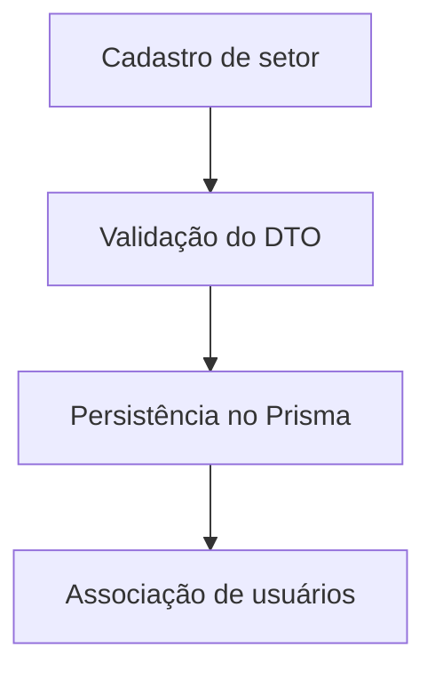

# Módulo Setores

## Objetivo

Estruturar o ambiente organizacional do sistema em setores ou áreas administrativas.

## Responsabilidades

- gerenciar setores do sistema;
- permitir a associação de usuários a setores;
- apoiar a organização da hierarquia operacional.

## Entidades pertencentes

- Setor
- UsuarioSetor

## Relacionamentos com outros módulos

- um setor pode ter vários usuários associados;
- o setor é usado para organizar permissões e estrutura funcional.

## Fluxo de funcionamento

## Principais endpoints

| Método | Endpoint | Descrição |
| --- | --- | --- |
| POST | /setores | Cria um setor |
| GET | /setores | Lista setores |
| GET | /setores/:id | Busca um setor |
| PATCH | /setores/:id | Atualiza um setor |
| DELETE | /setores/:id | Remove um setor |

## Dependências

- Prisma Client
- módulo de usuários-setores

## Regras de negócio relacionadas

- setores devem possuir nome único ou identificador claro;
- setor inativo não deve ser utilizado em operações principais.

## Funcionalidades futuras

- hierarquia entre setores;
- controle de supervisão e subordinação.

## Observações técnicas

O módulo é simples, mas pode evoluir para importações em lote e auditoria mais detalhada.
