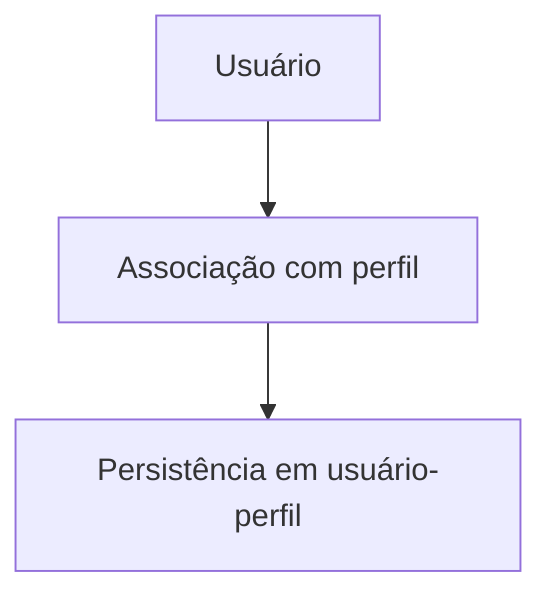

# Módulo Usuários-Perfis

## Objetivo

Vincular usuários a perfis definidos no sistema.

## Responsabilidades

- registrar atribuições de perfis;
- facilitar a composição de acessos por função.

## Entidades pertencentes

- UsuarioPerfil

## Relacionamentos com outros módulos

- depende de Usuario e Perfil.

## Fluxo de funcionamento

## Principais endpoints

| Método | Endpoint | Descrição |
| --- | --- | --- |
| POST | /usuarios-perfis | Cria vínculo |
| GET | /usuarios-perfis | Lista vínculos |
| GET | /usuarios-perfis/:id | Busca vínculo |
| PATCH | /usuarios-perfis/:id | Atualiza vínculo |
| DELETE | /usuarios-perfis/:id | Remove vínculo |

## Dependências

- usuários e perfis

## Regras de negócio relacionadas

- um usuário não deve ter duplicidade de vínculo para o mesmo perfil.

## Funcionalidades futuras

- histórico de atribuições;
- reassinalação por lote.

## Observações técnicas

Este módulo é uma base para futura autorização contextualizada.
