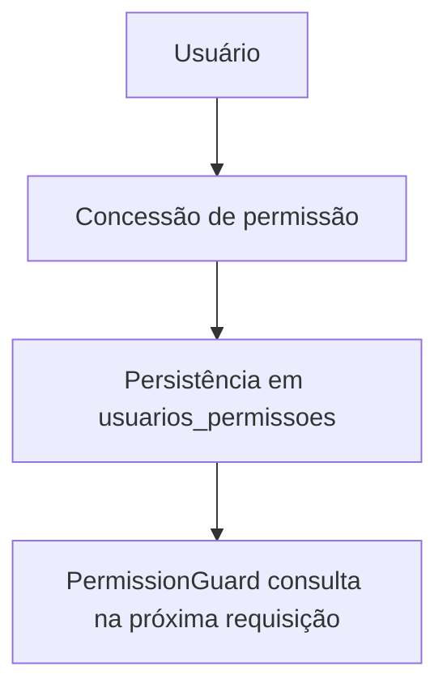

# Módulo Usuários-Permissões

## Objetivo

Conceder permissões diretamente a um usuário — sem Perfil/Role intermediário.

## Responsabilidades

- registrar/revogar a concessão de uma permissão a um usuário;
- servir de fonte única para `UsuariosService.hasPermission`/`isAdmin`
  (ver [rbac.md](../rbac.md)).

## Entidades pertencentes

- UsuarioPermissao (`usuario_id` + `permissao_id`, único)

## Relacionamentos com outros módulos

- depende de Usuario e Permissao.
- é consultado por todo `@RequirePermission` do sistema (Hub, Desk, Rooms,
  Assets) através de `UsuariosService.getAccess`.

## Fluxo de funcionamento

## Principais endpoints

| Método | Endpoint | Descrição |
| --- | --- | --- |
| POST | /usuarios-permissoes | Concede uma permissão a um usuário |
| GET | /usuarios-permissoes | Lista concessões |
| GET | /usuarios-permissoes/:id | Busca uma concessão |
| DELETE | /usuarios-permissoes/:id | Revoga a permissão |

Não há `PATCH` — uma concessão é criada ou revogada, não editada.

## Regras de negócio relacionadas

- `(usuarioId, permissaoId)` é único — conceder a mesma permissão duas vezes
  não duplica o vínculo.
- Revogar a última permissão que dá acesso a `/hub/acessos` de um
  administrador não é bloqueado pelo backend — é responsabilidade de quem
  opera restaurar o acesso por outro usuário administrador, se isso acontecer
  por engano.
