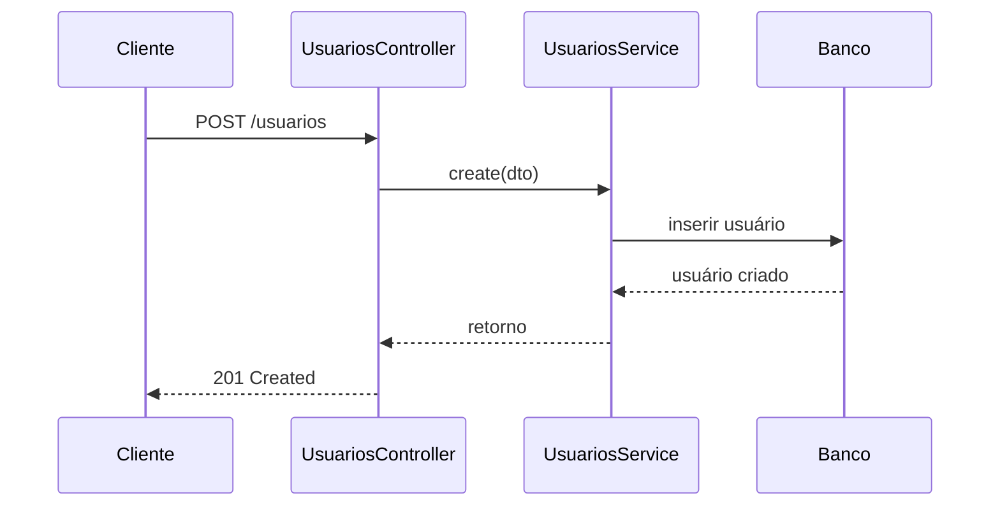

# Módulo Usuários

## Objetivo

Gerenciar cadastros de usuários do sistema, incluindo criação, atualização, ativação e remoção.

## Responsabilidades

- manter dados básicos do usuário;
- permitir ativar ou desativar usuários;
- servir como entidade central para relacionamentos com setores e perfis.

## Entidades pertencentes

- Usuario

## Relacionamentos com outros módulos

- muitos usuários podem estar associados a vários perfis;
- muitos usuários podem estar associados a vários setores;
- cada usuário pode receber notificações e gerar sessões e logs.

## Fluxo de funcionamento

## Principais endpoints

| Método | Endpoint | Descrição |
| --- | --- | --- |
| POST | /usuarios | Cria um usuário |
| GET | /usuarios | Lista usuários |
| GET | /usuarios/:id | Busca um usuário |
| PATCH | /usuarios/:id | Atualiza um usuário |
| DELETE | /usuarios/:id | Remove um usuário |
| GET | /usuarios/:id/acesso | Retorna perfis, permissões e módulos efetivos |
| GET | /usuarios/:id/acesso/verificar | Verifica acesso por `moduloId` e `acao` |

## Dependências

- Prisma Client
- DTOs de criação e atualização
- módulo de usuários-perfis e usuários-setores para relacionamento

## Regras de negócio relacionadas

- usuários devem possuir e-mail único;
- usuários podem ser desativados sem exclusão física;
- o acesso efetivo é composto pelos perfis associados e pelas permissões desses perfis;
- alterações devem ser registradas em auditoria futura.

## Funcionalidades futuras

- autenticação real via JWT;
- recuperação de senha;
- histórico de alterações de perfil.
- aplicação automática de guards conforme o acesso efetivo (RBAC), planejada para etapa posterior.

## Observações técnicas

O controller atual é simples e delega o fluxo ao service. A evolução natural é incluir validação de e-mail e senha, além de criptografia.
