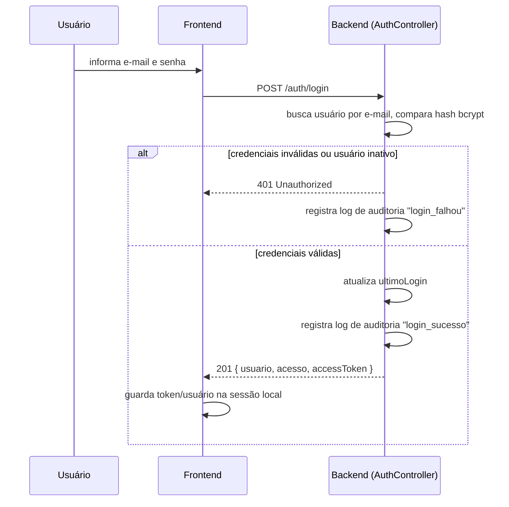
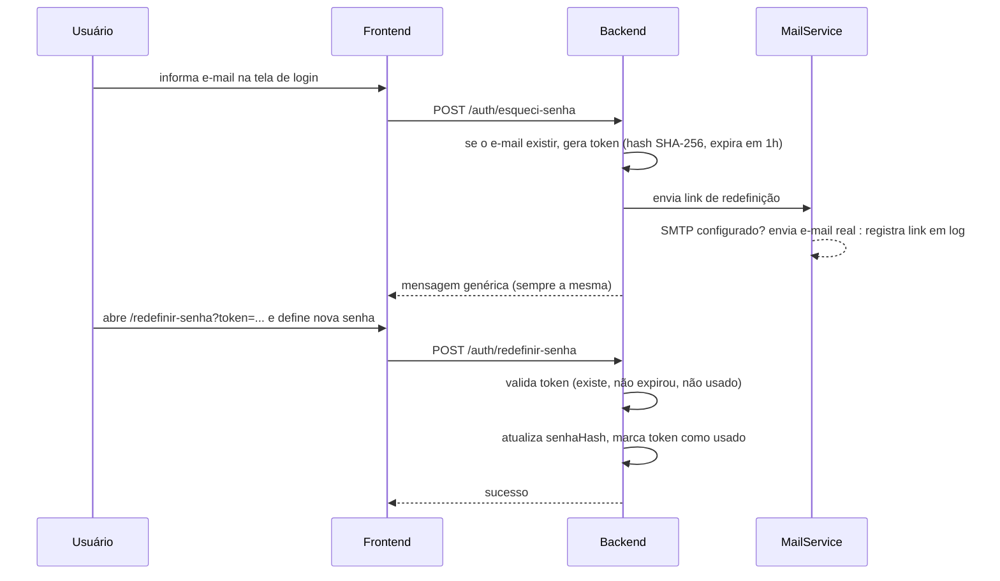
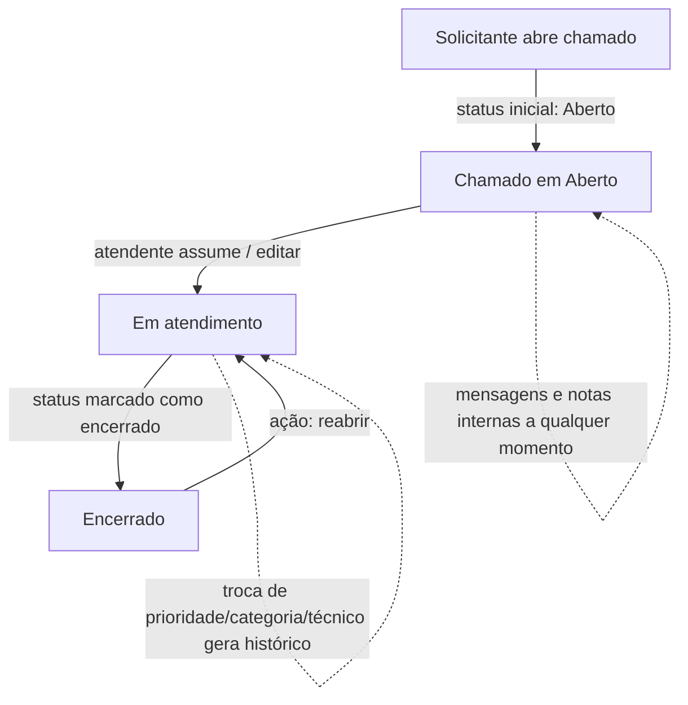
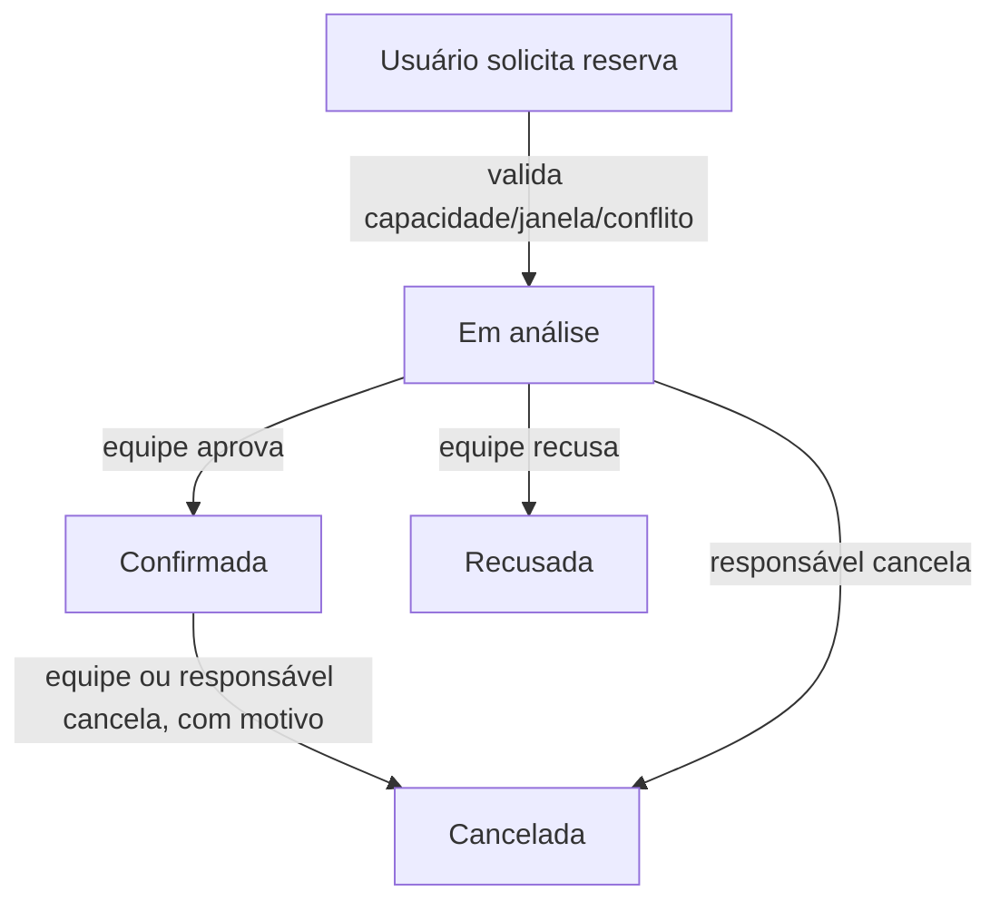
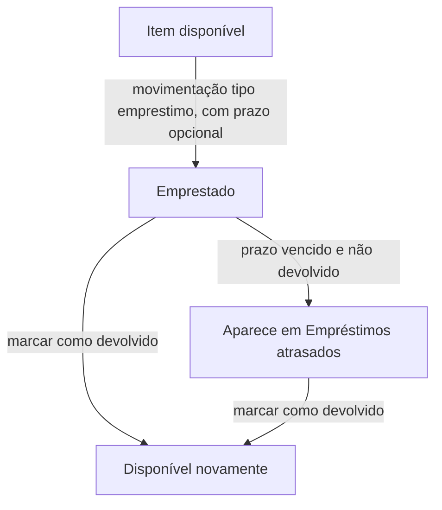
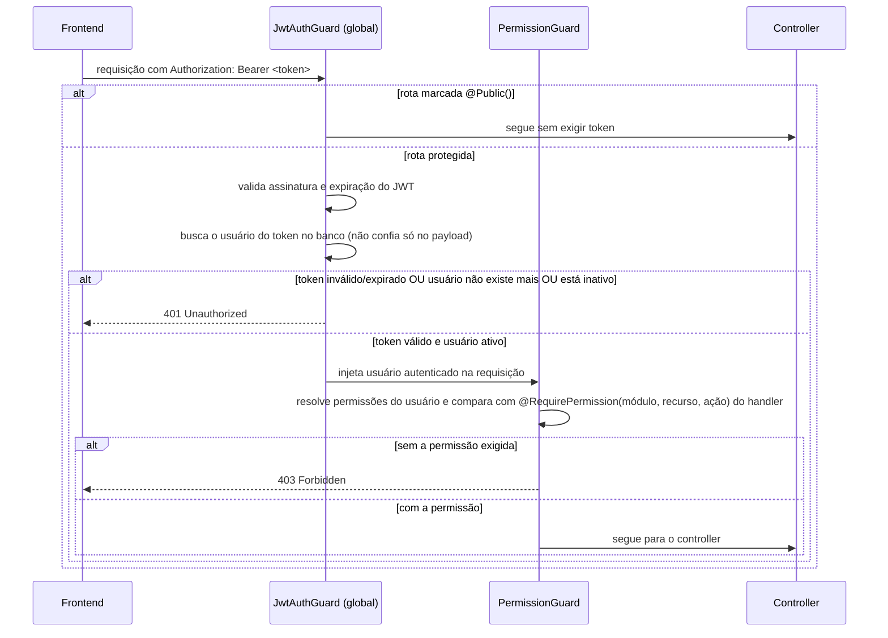

# Fluxos do Sistema — Rooster One

Fluxos verificados diretamente no código (controllers/services citados em cada diagrama). Fluxos técnicos internos (guards, interceptors) ficam em `docs/engineering/05-fluxos-tecnicos.md`.

## Login

## Redefinição de senha

## Ciclo de vida de um chamado (Desk)

Cada seta de mudança de status passa por uma checagem de permissão diferente (`editar`/`encerrar`/`reabrir`) e, se o valor realmente mudou, grava uma linha de histórico — ver RN005, RN006, RN009 em [04-regras-de-negocio.md](04-regras-de-negocio.md).

## Ciclo de vida de uma reserva (Rooms)

Para reserva recorrente, o mesmo fluxo de validação roda uma vez por ocorrência antes de qualquer linha ser criada (RN011); cancelar a série aplica o cancelamento a todas as ocorrências não canceladas de uma vez (RN012).

## Empréstimo de patrimônio (Assets)

## Checagem de autorização em toda rota protegida

