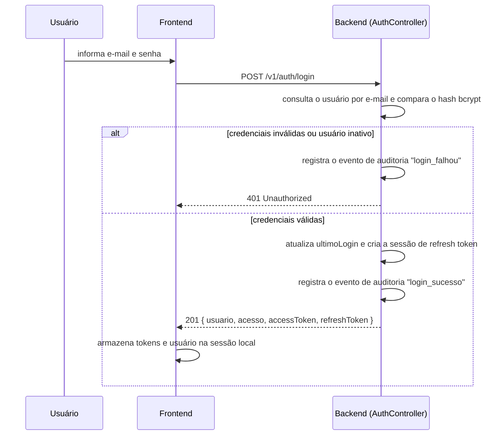
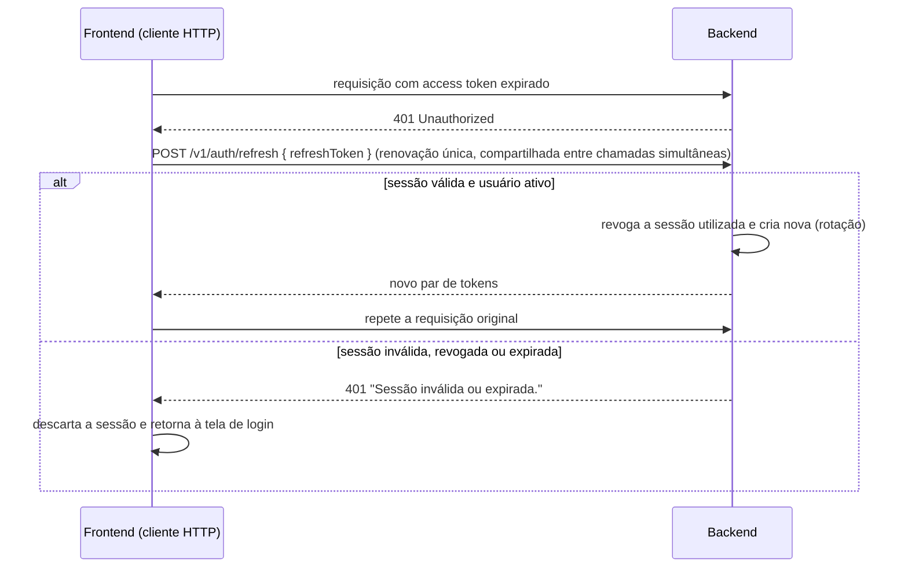
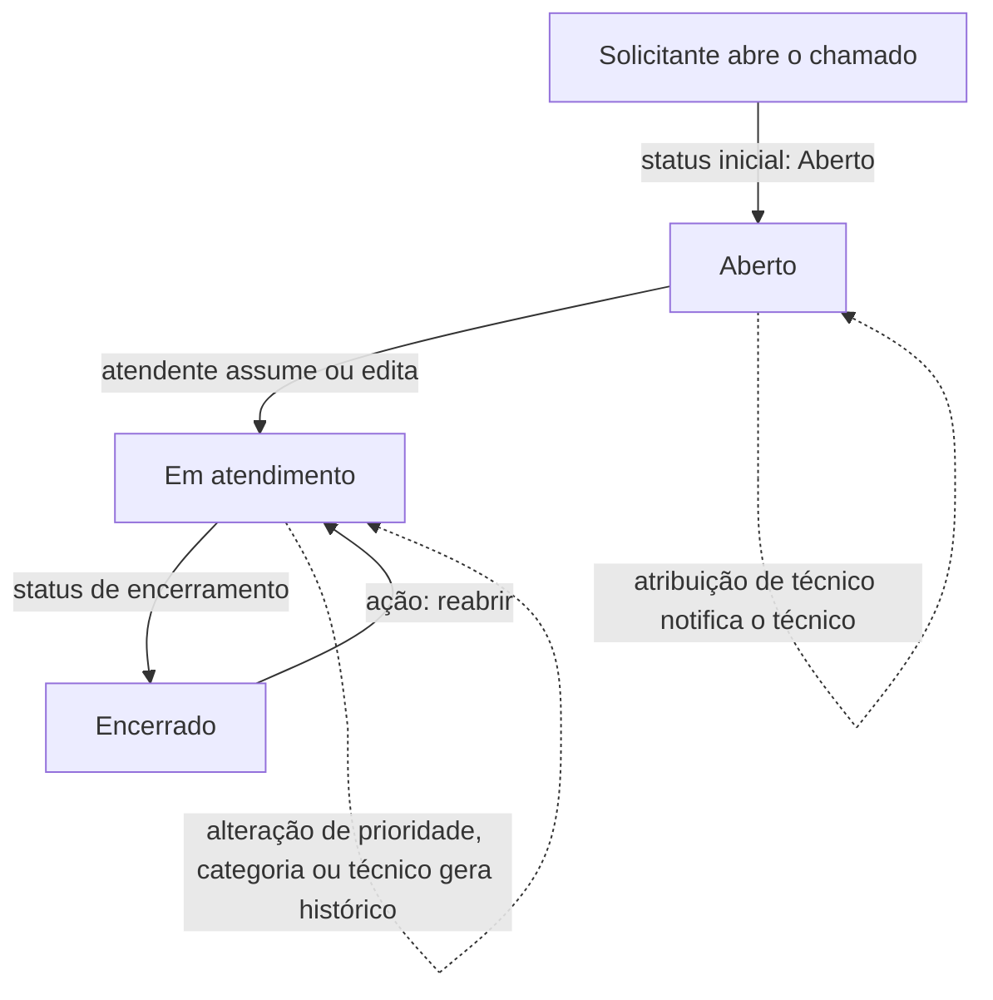
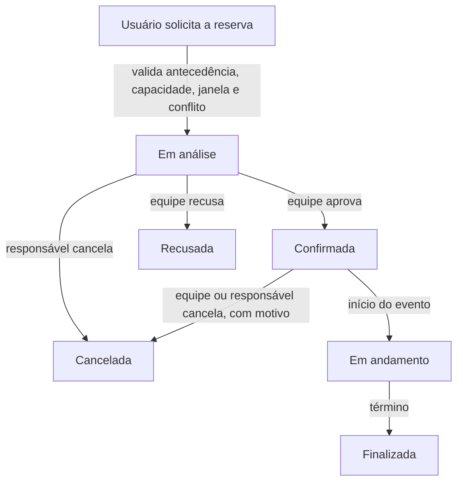
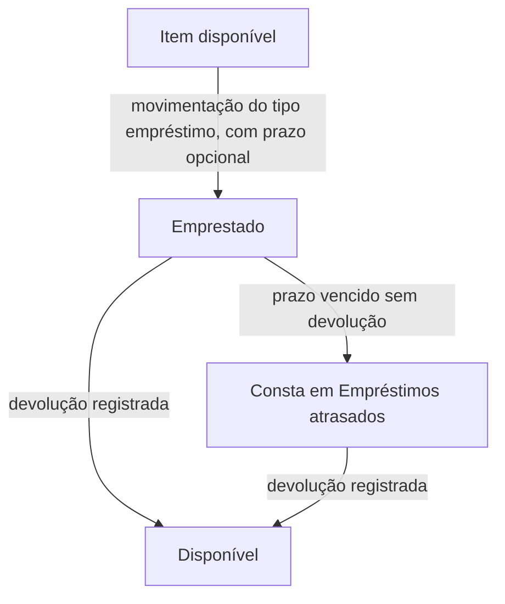
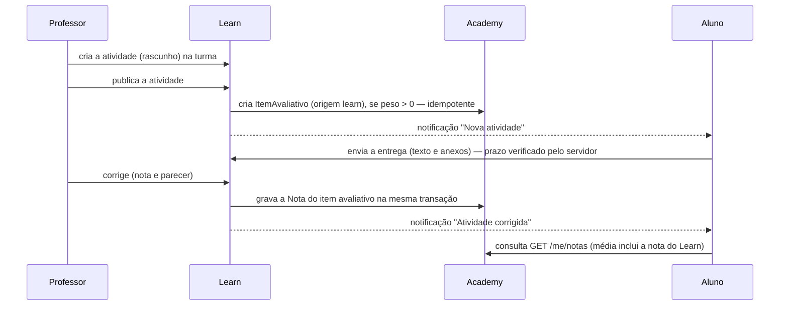
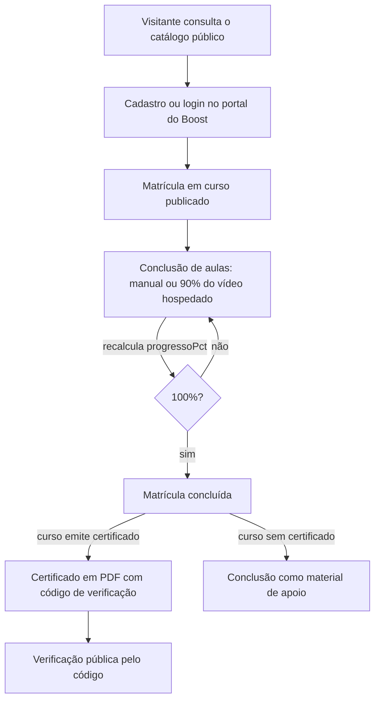
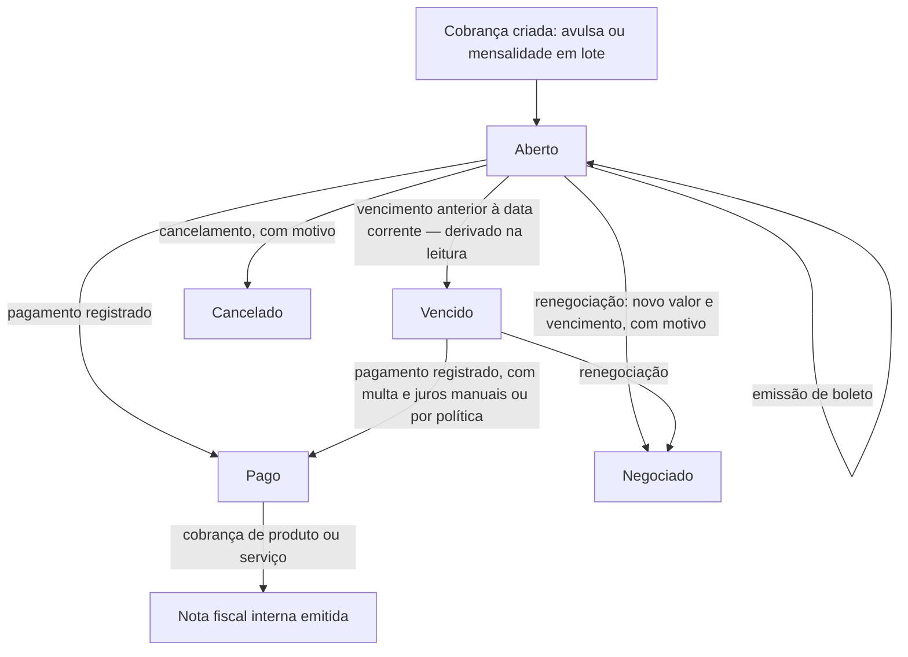
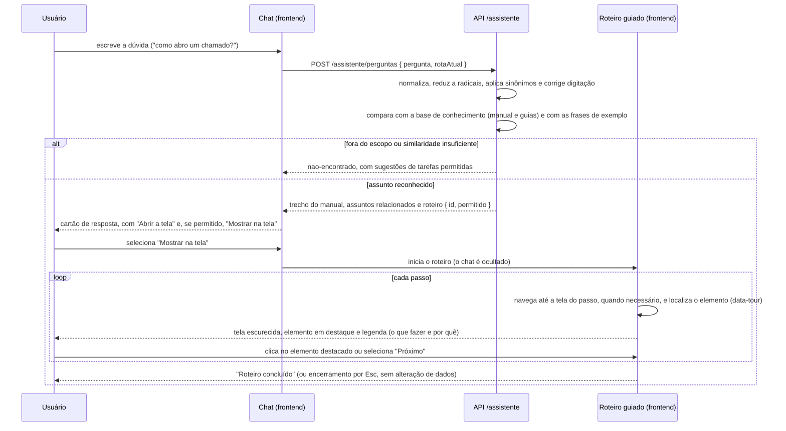
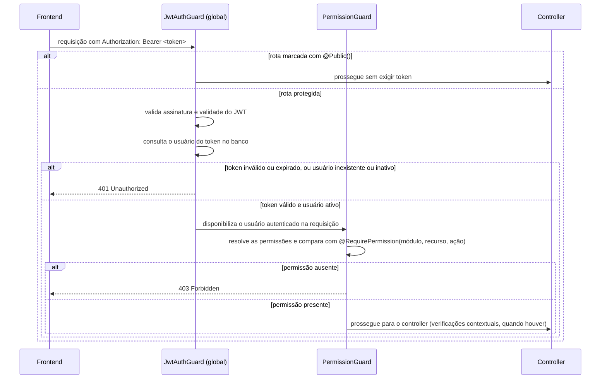

# Fluxos do Sistema — Rooster One

Fluxos verificados no código (os controllers e services correspondentes são citados em cada seção). Os fluxos
técnicos internos (guards, interceptores e transmissão em tempo real) estão em
`docs/engineering/05-fluxos-tecnicos.md`. Revisão de 01/10/2026.

## Login



## Renovação de sessão



## Redefinição de senha

```mermaid
sequenceDiagram
    participant U as Usuário
    participant F as Frontend
    participant B as Backend
    participant M as MailService
    U->>F: informa o e-mail na tela de login
    F->>B: POST /v1/auth/esqueci-senha
    B->>B: se o e-mail existir, gera token (hash SHA-256, validade de 1 hora)
    B->>M: envia o link de redefinição
    M-->>M: com SMTP, envia o e-mail; sem SMTP (fora de produção), registra em log com o token mascarado
    B-->>F: mensagem genérica (sempre a mesma)
    U->>F: abre /redefinir-senha?token=... e define a nova senha
    F->>B: POST /v1/auth/redefinir-senha
    B->>B: valida o token (existente, não expirado e não utilizado)
    B->>B: atualiza senhaHash, marca o token como utilizado e revoga as sessões
    B-->>F: sucesso
```

## Ciclo de vida de um chamado (Desk)



Cada mudança de status é submetida a verificação de permissão específica (`editar`, `encerrar` ou `reabrir`) e, se o
valor efetivamente mudou, gera registro de histórico; ver RN005, RN006 e RN009 em
[04-regras-de-negocio.md](04-regras-de-negocio.md).

## Ciclo de vida de uma reserva (Rooms)



Na reserva recorrente, a mesma validação é executada para cada ocorrência antes da gravação de qualquer registro
(RN011); o cancelamento da série aplica-se de uma vez a todas as ocorrências não canceladas (RN012). As alterações
de status realizadas pela equipe notificam o solicitante.

## Empréstimo de patrimônio (Assets)



## Atividade, entrega e nota (Learn → Academy)



## Matrícula e certificado (Boost)



## Ciclo de vida de uma cobrança (Finance)



As transições de pagamento, renegociação e cancelamento são registradas em auditoria e notificadas ao aluno.

## Dúvida no assistente e roteiro guiado



As operações executadas durante o roteiro (abrir o chamado, salvar o cadastro) são requisições comuns do próprio
usuário, sujeitas às permissões e validações de sempre (RN052).

## Verificação de autorização nas rotas protegidas


